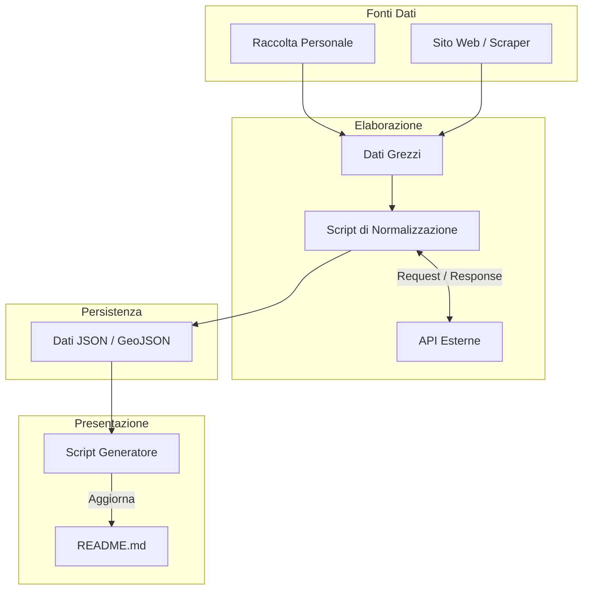
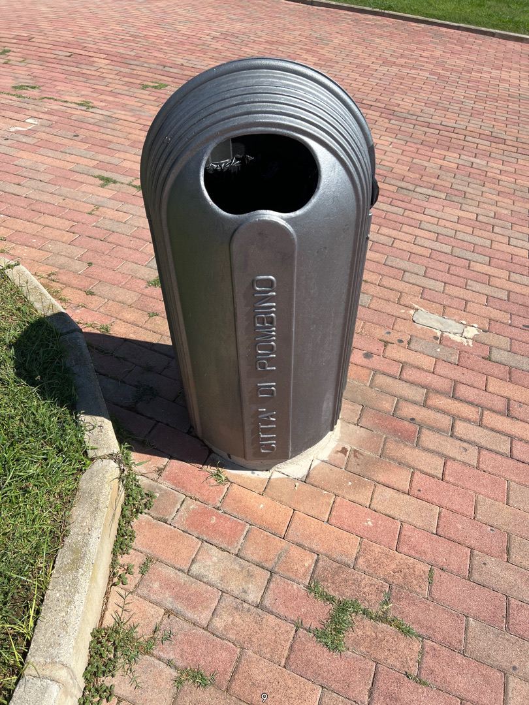
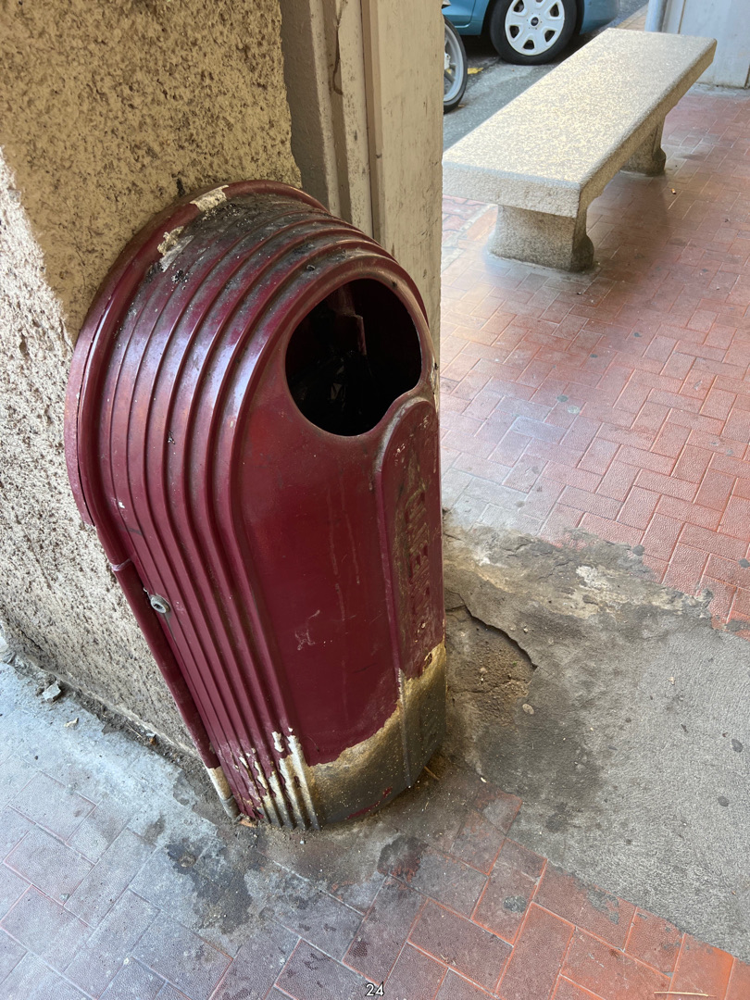
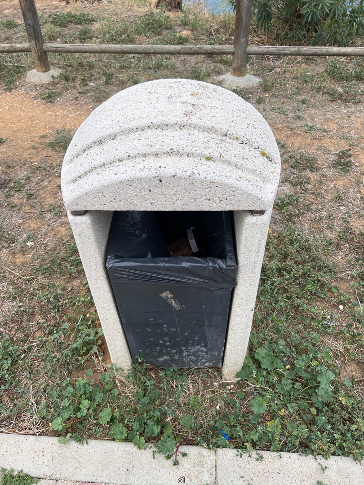
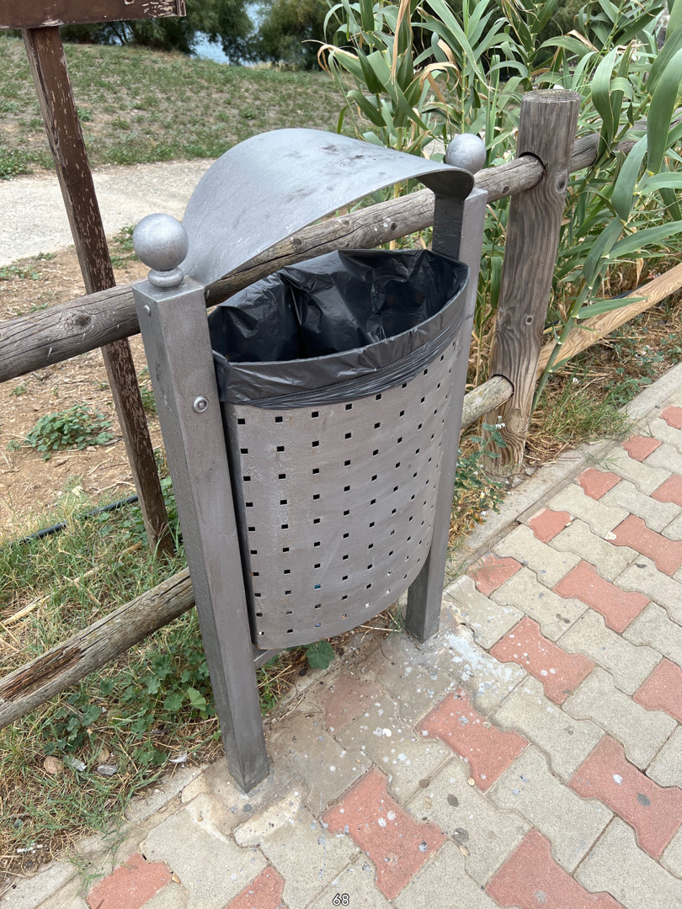
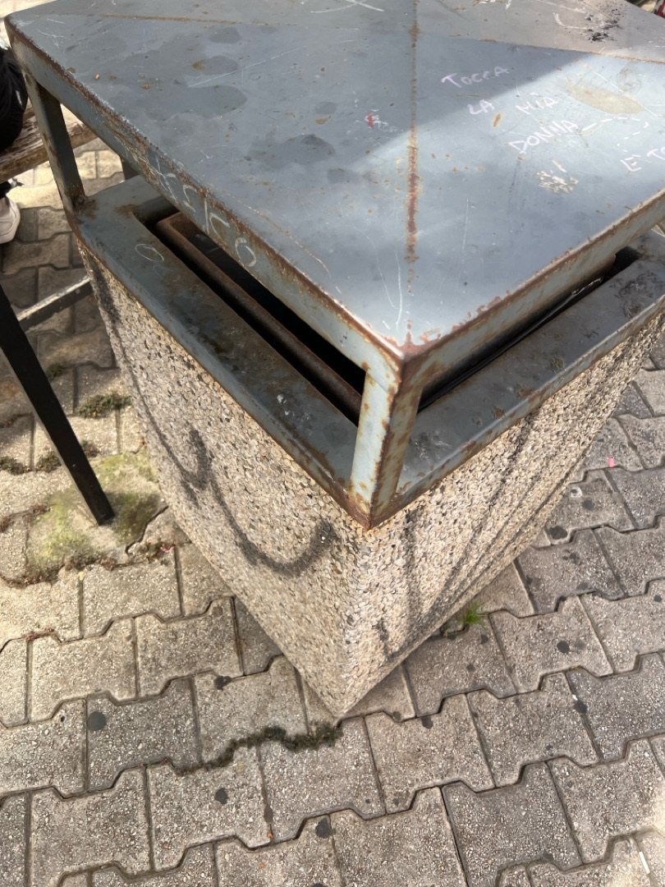
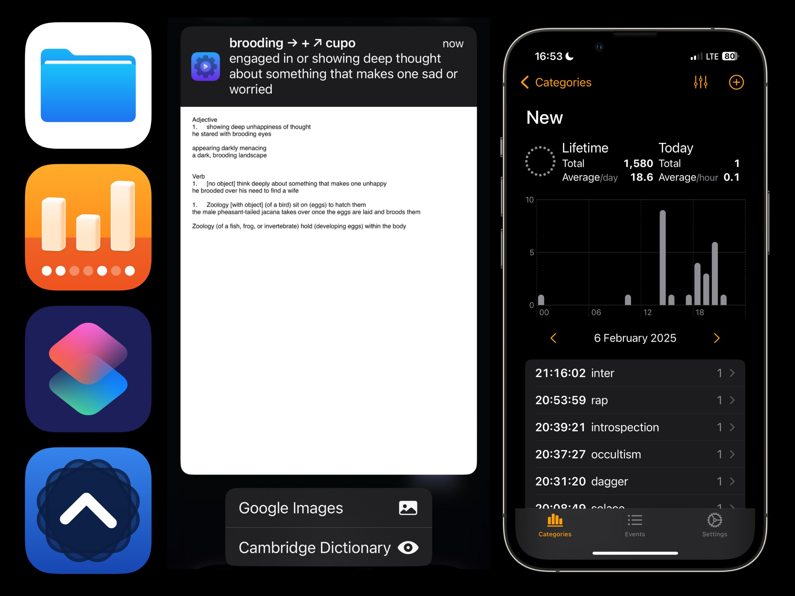

<p align="center">
  
</p>

<p align="center">
  Questo repository è il punto d'incontro tra la mia vita fisica e quella digitale. 
  Qui raccolgo e curo tutto ciò che traccio: dalle <strong>panchine</strong> che incontro passeggiando, alle <strong>partite di scacchi</strong> che gioco online, fino ai <strong>meme audio</strong> che hanno fatto la storia.
</p>


## Indice

- [Indice](#indice)
- [Struttura progetto](#struttura-progetto)
- [Come funziona](#come-funziona)
- [Dataset](#dataset)
  - [Cestini](#cestini)
  - [Panchine](#panchine)
  - [Fiori](#fiori)
  - [I am here](#i-am-here)
  - [Chess](#chess)
    - [Qualche ricordo](#qualche-ricordo)
  - [Zeb89](#zeb89)
  - [Voti](#voti)
  - [Speed tests](#speed-tests)
  - [Film](#film)
  - [Passi](#passi)
  - [Parole](#parole)
    - [Shortcut](#shortcut)
    - [Telegram](#telegram)
  - [Wordle](#wordle)


## Struttura progetto

<p align="right">(<a href="#indice">indice</a>)</p>

```graphql
├── assets/
│   └── credits/
├── data/
│   ├── cestini.geojson
│   ├── fiori.geojson
│   ├── iamhere.geojson
│   ├── panchine.geojson
│   ├── chess.json
│   ├── zeb89.json
│   ├── voti.json
│   ├── speedtests.json
│   ├── film.json
│   ├── passi.json
│   ├── parole.json
│   └── wordle.json
├── media/
│   ├── audio/
│   └── images/
├── README.md
```

## Come funziona



## Dataset

<p align="right">(<a href="#indice">indice</a>)</p>

<!-- tabella da aggiornare-->
<table>
<thead>
<tr>
<th>DATASET</th>
<th>FILE PATH</th>
<th>STANDARD</th>
<th>STATO</th>
<th>PRIMA ENTRY</th>
<th>ULTIMA ENTRY</th>
<th># ENTRIES</th>
<th>LIVE</th>
</tr>
</thead>
<tbody>
<tr>
<td>cestini</td>
<td><a href="data/cestini.geojson">/data/cestini.geojson</a></td>
<td>RFC 7946 (GeoJSON)</td>
<td>in pausa</td>
<td>2023-09-15</td>
<td>2024-02-16</td>
<td>260</td>
<td><a href="http://geojson.io/#data=data:text/x-url,https://cdn.jsdelivr.net/gh/plumkewe/open-lyubomyr@main/data/cestini.geojson">geojson.io</a></td>
</tr>
<tr>
<td>panchine</td>
<td><a href="data/panchine.geojson">/data/panchine.geojson</a></td>
<td>OSM Tags</td>
<td>in pausa</td>
<td>2023-10-06</td>
<td>2025-10-08</td>
<td>159</td>
<td><a href="http://geojson.io/#data=data:text/x-url,https://cdn.jsdelivr.net/gh/plumkewe/open-lyubomyr@main/data/panchine.geojson">geojson.io</a></td>
</tr>
<tr>
<td>fiori</td>
<td><a href="data/fiori.geojson">/data/fiori.geojson</a></td>
<td>GBIF Taxonomy</td>
<td>in pausa</td>
<td>2022-09-01</td>
<td>2023-10-06</td>
<td>189</td>
<td><a href="http://geojson.io/#data=data:text/x-url,https://cdn.jsdelivr.net/gh/plumkewe/open-lyubomyr@main/data/fiori.geojson">geojson.io</a></td>
</tr>
<tr>
<td>iamhere</td>
<td><a href="data/iamhere.geojson">/data/iamhere.geojson</a></td>
<td>OSM Artwork</td>
<td>completo</td>
<td></td>
<td></td>
<td>45</td>
<td><a href="http://geojson.io/#data=data:text/x-url,https://cdn.jsdelivr.net/gh/plumkewe/open-lyubomyr@main/data/iamhere.geojson">geojson.io</a></td>
</tr>
<tr>
<td>chess</td>
<td><a href="data/chess.json">/data/chess.json</a></td>
<td>PGN Standard</td>
<td>attivo</td>
<td>2022-11-05</td>
<td>2025-08-23</td>
<td>2383</td>
<td>-</td>
</tr>
<tr>
<td>zeb89</td>
<td><a href="data/zeb89.json">/data/zeb89.json</a></td>
<td>Custom JSON</td>
<td>completo</td>
<td></td>
<td></td>
<td>100</td>
<td>-</td>
</tr>
<tr>
<td>voti</td>
<td><a href="data/voti.json">/data/voti.json</a></td>
<td>Custom JSON</td>
<td>completo</td>
<td>2020-10-02</td>
<td>2025-06-03</td>
<td>343</td>
<td>-</td>
</tr>
<tr>
<td>speedtests</td>
<td><a href="data/speedtests.json">/data/speedtests.json</a></td>
<td>Custom JSON</td>
<td>completo</td>
<td>2024-12-23</td>
<td>2025-08-27</td>
<td>2111</td>
<td>-</td>
</tr>
<tr>
<td>film</td>
<td><a href="data/film.json">/data/film.json</a></td>
<td>Custom JSON</td>
<td>attivo</td>
<td>2023-04-07</td>
<td>2025-09-13</td>
<td>231</td>
<td>-</td>
</tr>
<tr>
<td>passi</td>
<td><a href="data/passi.json">/data/passi.json</a></td>
<td>Custom JSON</td>
<td>attivo</td>
<td>2021-09-24</td>
<td>2025-12-21</td>
<td>22358</td>
<td>-</td>
</tr>
<tr>
<td>parole</td>
<td><a href="data/parole.json">/data/parole.json</a></td>
<td>Custom JSON</td>
<td>attivo</td>
<td>2024-12-09</td>
<td>2025-12-08</td>
<td>3250</td>
<td>-</td>
</tr>
<tr>
<td>wordle</td>
<td><a href="data/wordle.json">/data/wordle.json</a></td>
<td>Custom JSON</td>
<td>attivo</td>
<td>2025-01-01</td>
<td>2025-12-01</td>
<td>325</td>
<td>-</td>
</tr></tbody></table>
<!-- tabella da aggiornare-->


<p align="right">(<a href="#indice">indice</a>)</p>

### Cestini

Tutto è nato dalla frustrazione di vedere rifiuti a pochi passi dai cestini a Piombino. Volevo capirci qualcosa di più, numeri alla mano. Ho creato un commando rapido sul mio iPhone che rende la raccolta dati immediata: vedo un cestino, faccio un tap, e lui archivia foto e posizione GPS.

Per approfondire il progetto, visita il mio blog: [CESTINI su aaa.craft.me](https://aaa.craft.me/blog/b/AE6DD80D-6506-46E1-B744-22B0EC17B047/)

<!-- data/cestini.geojson -->
```JSON
{
    "type": "Feature",
    "id": "4A12E89A-543C-4F56-B131-030CC40428DC",
    "geometry": {
    "type": "Point",
    "coordinates": [
        10.52283650762667,
        42.92546109446996
    ]
    },
    "properties": {
    "name": "Cestino",
    "ref": "1",
    "amenity": "waste_basket",
    "short_id": "O3QY4W",
    "address": "Via Giovanni Pascoli 2\n57025 Piombino Tuscany\nItaly",
    "type": "Nuovo",
    "image_url": "media/image/C019CAC7-8B2C-45C0-9F1F-802834FC0613.jpg",
    "created_at": "2023-09-15T10:22:56Z",
    "modified_at": "2023-09-15T10:22:57Z"
    }
}
```

<table>
  <tr>
    <th colspan="4">IMMAGINE</th>
    <th>TIPOLOGIA</th>
  </tr>
  
  <tr>
    <td></td>
    <td></td> <td></td> <td></td> <td>Nuovo</td>
  </tr>

  <tr>
    <td></td>
    <td></td>
    <td></td>
    <td></td>
    <td>Intero</td>
  </tr>

  <tr>
    <td></td>
    <td></td>
    <td></td>
    <td></td>
    <td>Piccolo</td>
  </tr>

  <tr>
    <td></td>
    <td></td>
    <td></td> <td></td> <td>Mezzo</td>
  </tr>

  <tr>
    <td></td>
    <td></td>
    <td></td>
    <td></td>
    <td>Struttura-B</td>
  </tr>

  <tr>
    <td></td>
    <td></td>
    <td></td>
    <td></td>
    <td>Struttura-M</td>
  </tr>

  <tr>
    <td></td>
    <td></td>
    <td></td>
    <td></td>
    <td>Struttura-M2</td>
  </tr>
  
  <tr>
    <td></td>
    <td></td>
    <td></td>
    <td></td>
    <td>Struttura-M3</td>
  </tr>

  <tr>
    <td></td>
    <td></td>
    <td></td>
    <td></td>
    <td>Struttura-M4</td>
  </tr>
</table>

### Panchine

<!-- data/panchine.geojson -->
<details>
<summary>Struttura</summary>

```json
{
    "type": "Feature",
    "id": "7459E15D-4735-4721-9C8E-5C34B251010A",
    "geometry": {
        "type": "Point",
        "coordinates": [
            10.525580861797891,
            42.92213019024307
        ]
    },
    "properties": {
        "name": "Panchina",
        "ref": "1",
        "amenity": "bench",
        "short_id": "CHM3JM",
        "address": "Via della Marina 7–99\n57025 Piombino Tuscany\nItaly",
        "image_url": "media/image/83A5EB23-3B48-46B5-8491-D2E4EEA04D7C.jpg",
        "created_at": "2023-10-06T15:59:54Z",
        "modified_at": "2023-10-06T15:59:56Z"
    }
}
```
</details>

<hr>

### Fiori

Volevo avere un dataset dei fiori, così me lo sono creato. Ora so dove si trovano vari fiori e anche di che colore sono! Dovrei però aggiungere i dati su quando fioriscono.

<!-- data/fiori.geojson -->
<details>
<summary>Struttura</summary>

```json
{
    "type": "Feature",
    "id": "1F301B96-5AD7-4968-A1BA-5745ADF6F450",
    "geometry": {
        "type": "Point",
        "coordinates": [
            10.52161,
            42.92774
        ]
    },
    "properties": {
        "natural": "plant",
        "scientificName": "Rose",
        "vernacularName": "Rose",
        "flower:colour": "#10C9CC",
        "eventDate": "2023-10-06T16:59:34Z",
        "occurrenceRemarks": "",
        "associatedMedia": "media/image/3412DCCC-E76B-4323-8382-0F9F2E90FC81.jpg",
        "short_id": "X49XV6",
        "address": "Via Filippo Turati 6A\n57025 Piombino Toscana\nItalia"
    }
}
```
</details>

<hr>

### I am here

Ogni tanto uscivo a Piombino e mi imbattevo in dei graffiti "I am here". Mi ero incuriosito, così ho iniziato a camminare sia nella realtà sia su Google Maps, usando la funzione “guarda indietro”, per individuare i graffiti che ormai sono stati cancellati o parzialmente coperti.

<!-- data/iamhere.geojson -->
<details>
<summary>Struttura</summary>

```json
{
    "type": "Feature",
    "id": "6160A864-7255-455D-A9D0-8900FFB34B62",
    "geometry": {
        "type": "Point",
        "coordinates": [
            10.5319904,
            42.9257633
        ]
    },
    "properties": {
        "id": "6160A864-7255-455D-A9D0-8900FFB34B62",
        "name": "I am here",
        "tourism": "artwork",
        "artwork_type": "graffiti",
        "inscription": "I am here",
        "original_note": "",
        "comment": "",
        "visibility": "public"
    }
}
```
</details>

<hr>

### Chess

Avevo co-fondato Scacchi Piombino insieme al mio amico e, a quel tempo, giocavo molto a scacchi. Allora mi sono detto: “Perché non avere un dataset per confermare quanto faccio schifo?”. Tutto è iniziato con un semplice messaggio: “E se facessimo un club scacchistico?” E niente, l’abbiamo fatto! Lo trovate ancora su Google Maps. 

Avevamo anche collaborato con la Biblioteca Civica Falesiana; potete trovare qualche post sulla loro pagina Facebook.

**Link:** https://maps.app.goo.gl/FW8y27prsTJfGnFaA

#### Qualche ricordo 

<table>
    <tr>
        <th>Inizio</th>
        <th>Il gruppo su WA eravamo quasi 100 al picco</th>
        <th>Il volantino che fu stampato</th>
    </tr>
    <tr>
        <td align="center">
            
        </td>
        <td align="center">
            
        </td>
        <td align="center">
            
        </td>
    </tr>
</table>


<!-- data/chess.json -->
<details>
<summary>Struttura</summary>

```json
{
    "id": "486731945",
    "url": "https://www.chess.com/game/daily/486731945",
    "date": "2023.03.06",
    "pgn_result": "1-0",
    "termination": "checkmated",
    "move_count": 18,
    "fen": "r1b2k1r/ppN3Qp/2p1p2B/8/4P3/3P4/PPP3PP/R2K4 b - - 0 18",
    "pgn": "[Event \"Let's Play!\"]\n[Site \"Chess.com\"]\n[Date \"2023.03.06\"]\n[Round \"-\"]\n[White \"faxtrix\"]\n[Black \"manofurlas\"]\n[Result \"1-0\"]\n[CurrentPosition \"r1b2k1r/ppN3Qp/2p1p2B/8/4P3/3P4/PPP3PP/R2K4 b - - 0 18\"]\n[Timezone \"UTC\"]\n[ECO \"C25\"]\n[ECOUrl \"https://www.chess.com/openings/Vienna-Game-Anderssen-Defense-3.Bc4-Nf6\"]\n[UTCDate \"2023.03.06\"]\n[UTCTime \"20:38:41\"]\n[WhiteElo \"400\"]\n[BlackElo \"400\"]\n[TimeControl \"1/86400\"]\n[Termination \"faxtrix won by checkmate\"]\n[StartTime \"20:38:41\"]\n[EndDate \"2023.03.07\"]\n[EndTime \"14:14:41\"]\n[Link \"https://www.chess.com/game/daily/486731945\"]\n\n1. e4 {[%clk 0:00:03.3]} 1... e5 {[%clk 0:00:01.8]} 2. Bc4 {[%clk 0:00:06.7]} 2... Bc5 {[%clk 0:00:04.5]} 3. Nc3 {[%clk 0:00:06.6]} 3... Nf6 {[%clk 0:03:38.8]} 4. Nf3 {[%clk 0:00:35.9]} 4... Qe7 {[%clk 0:00:13.9]} 5. d3 {[%clk 0:01:12]} 5... Ng4 {[%clk 0:00:21.8]} 6. Nd5 {[%clk 0:00:38.6]} 6... Nxf2 {[%clk 0:00:15.3]} 7. Qe2 {[%clk 0:00:19.9]} 7... Qe6 {[%clk 0:00:08.8]} 8. Nxc7+ {[%clk 0:00:01.5]} 8... Ke7 {[%clk 0:02:19.5]} 9. Bxe6 {[%clk 0:00:05.2]} 9... fxe6 {[%clk 0:00:01.6]} 10. Rf1 {[%clk 0:00:02.7]} 10... Ng4 {[%clk 0:00:02.5]} 11. Bg5+ {[%clk 0:01:13.7]} 11... Kf7 {[%clk 0:00:03.7]} 12. Nxe5+ {[%clk 0:00:01.6]} 12... Kg8 {[%clk 0:00:59.1]} 13. Qxg4 {[%clk 0:00:00.6]} 13... Bb4+ {[%clk 0:06:35.3]} 14. Kd1 {[%clk 0:00:13.2]} 14... Nc6 {[%clk 1:10:15.2]} 15. Nxc6 {[%clk 0:06:50.8]} 15... dxc6 {[%clk 0:04:34.9]} 16. Bh6 {[%clk 0:00:30]} 16... Bf8 {[%clk 0:03:47.5]} 17. Rxf8+ {[%clk 0:00:06.8]} 17... Kxf8 {[%clk 0:00:01.1]} 18. Qxg7# {[%clk 0:00:01.6]} 1-0",
    "players": {
        "white": {
            "username": "faxtrix",
            "rating": 400,
            "accuracy": 93.61,
            "result": "win"
        },
        "black": {
            "username": "manofurlas",
            "rating": 400,
            "accuracy": 64.42,
            "result": "loss"
        }
    }
}
```
</details>

<hr>

### Zeb89

Avevo scoperto questo YouTuber che abitava a Bibbona e i suoi vecchi video mi fecero ridere così tanto che mi dissi: “Ma perché non mi faccio una soundboard tutta mia con le sue frasi più iconiche?”. E così l’ho fatto.

<!-- data/zeb89.json -->
<details>
<summary>Struttura</summary>

```json
{
    "id": "BB410D05-366C-4445-B428-E23AD26615B5",
    "short_id": "0IMON0",
    "filename": "0IMON0.m4a",
    "title": "vaffanculo pezzo di merda",
    "description": "",
    "duration_seconds": 6,
    "category": "Uncategorized",
    "is_published": true
}
```
</details>

<hr>

### Voti

Ero curioso di sapere quanto facessi schifo a scuola e quanto me ne potesse fregare ancora di meno.

<!-- data/voti.json -->
<details>
<summary>Struttura</summary>

```json
{
    "id": "D22ABDAC-B338-4E25-8B1D-794AFC1D06DE",
    "subject": "Italiano",
    "date": "2020-10-02",
    "grade": 5.0,
    "type": "scritto"
}
```
</details>

<hr>

### Speed tests

Odio WindTre e le loro offerte del c*zzo, come quella che avevo io: 5G cappato a 10 Mbps che non erano mai davvero 10 Mbps. Per questo sono passato a CoopVoce che, all’epoca, si appoggiava a TIM e con cui navigavo molto meglio. Da lì avevo iniziato a fare speed test ogni ora, nella stessa posizione e con lo stesso telefono, per dimostrare quanto facesse schifo WindTre.

Alla fine, però, sono passato direttamente a TIM, perché CoopVoce stava migrando su Vodafone e le velocità erano diventate impraticabili.

Per approfondire il progetto, visita il mio blog: [ISP su aaa.craft.me](https://aaa.craft.me/blog/b/1E243D83-B680-41A5-8B1D-8F6BFC76412B/(ISP))

<!-- data/speedtests.json -->
<details>
<summary>Struttura</summary>

```json
{
    "id": "1B7B1A16-D15A-4F1F-92C2-0378DFC585AC",
    "timestamp": "2025-08-27T15:00:00",
    "type": "LTE",
    "vpn": false,
    "location": {
        "lat": 44.4847,
        "lon": 11.328,
        "server": "Rome"
    },
    "performance": {
        "download_mbps": 4.59,
        "upload_mbps": 2.63,
        "latency_ms": 35,
        "data_used": {
            "down_bytes": 5889131,
            "up_bytes": 3621204
        }
    },
    "network_info": {
        "external_ip": "193.207.155.47"
    }
}
```
</details>

<hr>

### Film

Ogni tanto guardo qualche film, ma purtroppo le app disponibili non permettono di vedere e analizzare i dati sui film. Perciò ho trovato una mia soluzione.

<!-- data/film.json -->
<details>
<summary>Struttura</summary>

```json
{
    "meta": {
        "title": "Climax",
        "type": "movie",
        "poster_local": "media/image/47IXH2iEWwX0F7vIyGXaKQ0psBG.jpg",
        "poster_remote": "https://image.tmdb.org/t/p/w500/47IXH2iEWwX0F7vIyGXaKQ0psBG.jpg",
        "overview": "When a dance troupe is lured to an empty school, a bowl of drug-laced sangria causes their jubilant rehearsal to descend into a dark and explosive nightmare as they try to survive the night—and find who's responsible—before it's too late.",
        "genres": [
            "Horror",
            "Drama"
        ],
        "release_year": "2018",
        "vote_average": 7.0,
        "director": "Gaspar Noé",
        "cast": [
            "Sofia Boutella",
            "Romain Guillermic",
            "Souheila Yacoub",
            "Kiddy Smile",
            "Claude-Emmanuelle Gajan-Maull",
            "Giselle Palmer",
            "Taylor Kastle",
            "Thea Carla Schøtt",
            "Sharleen Temple",
            "Lea Vlamos"
        ]
    },
    "user_data": {
        "status": "plan to watch",
        "rating": null,
        "watched_at": ""
    },
    "ids": {
        "tmdb": "507076",
        "imdb": "tt8359848",
        "simkl": "770376"
    },
    "tmdb_raw": {
        "adult": false,
        "backdrop_path": "/v0sblc9A8eaE8EqDQ5Y6fELj4oB.jpg",
        "belongs_to_collection": null,
        "budget": 2900000,
        "genres": [
            {
                "id": 27,
                "name": "Horror"
            },
            {
                "id": 18,
                "name": "Drama"
            }
        ],
        "homepage": "https://a24films.com/films/climax",
        "id": 507076,
        "imdb_id": "tt8359848",
        "origin_country": [
            "FR"
        ],
        "original_language": "fr",
        "original_title": "Climax",
        "overview": "When a dance troupe is lured to an empty school, a bowl of drug-laced sangria causes their jubilant rehearsal to descend into a dark and explosive nightmare as they try to survive the night—and find who's responsible—before it's too late.",
        "popularity": 5.1643,
        "poster_path": "/47IXH2iEWwX0F7vIyGXaKQ0psBG.jpg",
        "production_companies": [
            {
                "id": 2700,
                "logo_path": "/h3bdysr6aNtFqK7DXQu1Rh43rwk.png",
                "name": "Rectangle Productions",
                "origin_country": "FR"
            },
            {
                "id": 856,
                "logo_path": "/3tfzS2CrX6Ntbu927XzHXEPDA6y.png",
                "name": "Wild Bunch",
                "origin_country": "FR"
            },
            {
                "id": 1157,
                "logo_path": "/2MXuq4DGo1GhjavHHxPlsWrtyD.png",
                "name": "Les Cinémas de la Zone",
                "origin_country": "FR"
            },
            {
                "id": 616,
                "logo_path": "/aeBPwUMUqIOFnt3Fxv9fC91hBuq.png",
                "name": "Eskwad",
                "origin_country": "FR"
            },
            {
                "id": 77154,
                "logo_path": null,
                "name": "KNM",
                "origin_country": "FR"
            },
            {
                "id": 94,
                "logo_path": "/huC7HqorvUThGIrENrbcHmQVUA0.png",
                "name": "ARTE France Cinéma",
                "origin_country": "FR"
            },
            {
                "id": 11773,
                "logo_path": "/8fCjsqh43LbPV6pm3SfR5Jx64GU.png",
                "name": "Artémis Productions",
                "origin_country": "BE"
            },
            {
                "id": 119267,
                "logo_path": "/b9Gw1Oz0d7rdxmpbJPQC0zQpmxw.png",
                "name": "VOO & Be tv",
                "origin_country": "BE"
            },
            {
                "id": 95061,
                "logo_path": "/gAt0ztKNX5gKyzNmIdaVxI5aoHv.png",
                "name": "Shelter Prod",
                "origin_country": "BE"
            },
            {
                "id": 149332,
                "logo_path": "/3pvLAa2Q3bWiRLPgBGokWSRSvWe.png",
                "name": "Vice Studios",
                "origin_country": "US"
            }
        ],
        "production_countries": [
            {
                "iso_3166_1": "BE",
                "name": "Belgium"
            },
            {
                "iso_3166_1": "FR",
                "name": "France"
            },
            {
                "iso_3166_1": "US",
                "name": "United States of America"
            }
        ],
        "release_date": "2018-09-19",
        "revenue": 1696075,
        "runtime": 97,
        "spoken_languages": [
            {
                "english_name": "English",
                "iso_639_1": "en",
                "name": "English"
            },
            {
                "english_name": "French",
                "iso_639_1": "fr",
                "name": "Français"
            }
        ],
        "status": "Released",
        "tagline": "Birth and death are extraordinary experiences. Life is a fleeting pleasure.",
        "title": "Climax",
        "video": false,
        "vote_average": 7.0,
        "vote_count": 2272,
        "credits": {
            "cast": [
                {
                    "adult": false,
                    "gender": 1,
                    "id": 568657,
                    "known_for_department": "Acting",
                    "name": "Sofia Boutella",
                    "original_name": "Sofia Boutella",
                    "popularity": 4.0305,
                    "profile_path": "/lGFhhjcjARQCM8AiGidyyyfDowh.jpg",
                    "cast_id": 21,
                    "character": "Selva",
                    "credit_id": "5af870f5c3a36845d10007cc",
                    "order": 0
                },
                {
                    "adult": false,
                    "gender": 2,
                    "id": 2041838,
                    "known_for_department": "Acting",
                    "name": "Romain Guillermic",
                    "original_name": "Romain Guillermic",
                    "popularity": 0.1917,
                    "profile_path": "/x4zDQbmtUQRiv0xvH5WaByjx7Hb.jpg",
                    "cast_id": 5,
                    "character": "David",
                    "credit_id": "5af86ec29251415a7e0006ad",
                    "order": 1
                },
                {
                    "adult": false,
                    "gender": 1,
                    "id": 2037046,
                    "known_for_department": "Acting",
                    "name": "Souheila Yacoub",
                    "original_name": "Souheila Yacoub",
                    "popularity": 0.8014,
                    "profile_path": "/zG087seFtSO2duW0ldsfbhFydce.jpg",
                    "cast_id": 22,
                    "character": "Lou",
                    "credit_id": "5af871e5c3a36845d7000f4e",
                    "order": 2
                },
                {
                    "adult": false,
                    "gender": 2,
                    "id": 2134233,
                    "known_for_department": "Acting",
                    "name": "Kiddy Smile",
                    "original_name": "Kiddy Smile",
                    "popularity": 0.4465,
                    "profile_path": "/gCSoEGvTBymcVZ8saG3opCEGcQU.jpg",
                    "cast_id": 43,
                    "character": "Daddy",
                    "credit_id": "5ba8738cc3a3680e6103f095",
                    "order": 3
                },
                {
                    "adult": false,
                    "gender": 1,
                    "id": 2041840,
                    "known_for_department": "Acting",
                    "name": "Claude-Emmanuelle Gajan-Maull",
                    "original_name": "Claude-Emmanuelle Gajan-Maull",
                    "popularity": 0.6489,
                    "profile_path": "/lyVv0cllzSvEdMjN6bzbxLvcsoc.jpg",
                    "cast_id": 7,
                    "character": "Emmanuelle",
                    "credit_id": "5af86ee39251415a81000978",
                    "order": 4
                },
                {
                    "adult": false,
                    "gender": 1,
                    "id": 2134242,
                    "known_for_department": "Acting",
                    "name": "Giselle Palmer",
                    "original_name": "Giselle Palmer",
                    "popularity": 0.2571,
                    "profile_path": "/wSiels0qR5U9rHJnFtsfaVDcoQb.jpg",
                    "cast_id": 51,
                    "character": "Gazelle",
                    "credit_id": "5ba87e709251412f0a03c420",
                    "order": 5
                },
                {
                    "adult": false,
                    "gender": 2,
                    "id": 2041839,
                    "known_for_department": "Acting",
                    "name": "Taylor Kastle",
                    "original_name": "Taylor Kastle",
                    "popularity": 0.4466,
                    "profile_path": "/6UYtRy4OrnP0UC0qYNGjKnBclXM.jpg",
                    "cast_id": 6,
                    "character": "Taylor",
                    "credit_id": "5af86ed2c3a36845e90008bc",
                    "order": 6
                },
                {
                    "adult": false,
                    "gender": 1,
                    "id": 2041843,
                    "known_for_department": "Acting",
                    "name": "Thea Carla Schøtt",
                    "original_name": "Thea Carla Schøtt",
                    "popularity": 0.2564,
                    "profile_path": "/bfM8bwfrTDVOrK5tDRBNJJnGOo5.jpg",
                    "cast_id": 10,
                    "character": "Psyche",
                    "credit_id": "5af86f219251415a750005e9",
                    "order": 7
                },
                {
                    "adult": false,
                    "gender": 0,
                    "id": 2041844,
                    "known_for_department": "Acting",
                    "name": "Sharleen Temple",
                    "original_name": "Sharleen Temple",
                    "popularity": 1.0258,
                    "profile_path": "/5XpMD3FKXhmZ9AxAu9jaZVSLac4.jpg",
                    "cast_id": 11,
                    "character": "Ivana",
                    "credit_id": "5af86f2ac3a36845dd0009aa",
                    "order": 8
                },
                {
                    "adult": false,
                    "gender": 1,
                    "id": 2041845,
                    "known_for_department": "Acting",
                    "name": "Lea Vlamos",
                    "original_name": "Lea Vlamos",
                    "popularity": 0.1722,
                    "profile_path": "/wmdILTYDHsNwEwNsKVH8ZqtRRTV.jpg",
                    "cast_id": 12,
                    "character": "Eva",
                    "credit_id": "5af86f35c3a36845d10006ec",
                    "order": 9
                },
                {
                    "adult": false,
                    "gender": 1,
                    "id": 2041834,
                    "known_for_department": "Acting",
                    "name": "Alaïa Alsafir",
                    "original_name": "Alaïa Alsafir",
                    "popularity": 0.2868,
                    "profile_path": "/1UkL0gw41OTl4eArpuodrznTZkf.jpg",
                    "cast_id": 1,
                    "character": "Alaia",
                    "credit_id": "5af86e97c3a36845e900087b",
                    "order": 10
                },
                {
                    "adult": false,
                    "gender": 2,
                    "id": 2041841,
                    "known_for_department": "Acting",
                    "name": "Kendall Mugler",
                    "original_name": "Kendall Mugler",
                    "popularity": 0.0286,
                    "profile_path": null,
                    "cast_id": 8,
                    "character": "Rocket",
                    "credit_id": "5af86eedc3a36845f8000970",
                    "order": 11
                },
                {
                    "adult": false,
                    "gender": 0,
                    "id": 2041837,
                    "known_for_department": "Acting",
                    "name": "Lakdhar Dridi",
                    "original_name": "Lakdhar Dridi",
                    "popularity": 0.2256,
                    "profile_path": "/dtipVM1QqYpCeVFtxQ6UtbgdTYs.jpg",
                    "cast_id": 4,
                    "character": "Riley",
                    "credit_id": "5af86eb50e0a2674ec000827",
                    "order": 12
                },
                {
                    "adult": false,
                    "gender": 0,
                    "id": 2134234,
                    "known_for_department": "Acting",
                    "name": "Adrien Sissoko",
                    "original_name": "Adrien Sissoko",
                    "popularity": 0.0598,
                    "profile_path": "/sPJ9nk67xXpasE3ZngTllUgM4vm.jpg",
                    "cast_id": 44,
                    "character": "Omar",
                    "credit_id": "5ba874259251412f0a03ae50",
                    "order": 13
                },
                {
                    "adult": false,
                    "gender": 0,
                    "id": 2041835,
                    "known_for_department": "Acting",
                    "name": "Mamadou Bathily",
                    "original_name": "Mamadou Bathily",
                    "popularity": 0.0538,
                    "profile_path": "/b3BjV2gVvj6eV2bAB4rqjJgA593.jpg",
                    "cast_id": 2,
                    "character": "Bart",
                    "credit_id": "5af86ea29251415a7b000755",
                    "order": 14
                },
                {
                    "adult": false,
                    "gender": 0,
                    "id": 2134235,
                    "known_for_department": "Acting",
                    "name": "Alou Sidibé",
                    "original_name": "Alou Sidibé",
                    "popularity": 0.1189,
                    "profile_path": "/oAgWVxBa3WNteBLxfO0hP7rN7Qh.jpg",
                    "cast_id": 45,
                    "character": "Kyrra",
                    "credit_id": "5ba874529251412f0103daa7",
                    "order": 15
                },
                {
                    "adult": false,
                    "gender": 0,
                    "id": 2041836,
                    "known_for_department": "Acting",
                    "name": "Ashley Biscette",
                    "original_name": "Ashley Biscette",
                    "popularity": 0.1855,
                    "profile_path": "/aQIdm8aRRakw1Xn8ZsV29tJeoKd.jpg",
                    "cast_id": 3,
                    "character": "Shirley",
                    "credit_id": "5af86eac0e0a2674e600092b",
                    "order": 16
                },
                {
                    "adult": false,
                    "gender": 0,
                    "id": 2134236,
                    "known_for_department": "Acting",
                    "name": "Mounia Nassangar",
                    "original_name": "Mounia Nassangar",
                    "popularity": 0.0434,
                    "profile_path": "/kh5cGnMKpsFS0WA6kTxB0PmOfEu.jpg",
                    "cast_id": 46,
                    "character": "Dom",
                    "credit_id": "5ba8747fc3a3680e5803f8b0",
                    "order": 17
                },
                {
                    "adult": false,
                    "gender": 0,
                    "id": 2134237,
                    "known_for_department": "Acting",
                    "name": "Tiphanie Au",
                    "original_name": "Tiphanie Au",
                    "popularity": 0.0759,
                    "profile_path": null,
                    "cast_id": 47,
                    "character": "Sila",
                    "credit_id": "5ba87496c3a3680e6503ee57",
                    "order": 18
                },
                {
                    "adult": false,
                    "gender": 1,
                    "id": 1821647,
                    "known_for_department": "Crew",
                    "name": "Sarah Belala",
                    "original_name": "Sarah Belala",
                    "popularity": 0.1985,
                    "profile_path": "/amFRwu8mcA9qI61B9FiXTUSK7vB.jpg",
                    "cast_id": 41,
                    "character": "Jennifer",
                    "credit_id": "5ba5e5e8c3a3680e58004110",
                    "order": 19
                },
                {
                    "adult": false,
                    "gender": 0,
                    "id": 2132538,
                    "known_for_department": "Acting",
                    "name": "Alexandre Moreau",
                    "original_name": "Alexandre Moreau",
                    "popularity": 0.0261,
                    "profile_path": "/kJqEyfT9ttUJ98ToOiAtSIl97m1.jpg",
                    "cast_id": 42,
                    "character": "Cyborg",
                    "credit_id": "5ba5e61b9251412ef4003924",
                    "order": 20
                },
                {
                    "adult": false,
                    "gender": 0,
                    "id": 2134238,
                    "known_for_department": "Acting",
                    "name": "Naab",
                    "original_name": "Naab",
                    "popularity": 0.0429,
                    "profile_path": null,
                    "cast_id": 48,
                    "character": "Rocco",
                    "credit_id": "5ba874b89251412ef603d183",
                    "order": 21
                },
                {
                    "adult": false,
                    "gender": 0,
                    "id": 2134239,
                    "known_for_department": "Acting",
                    "name": "Strauss Serpent",
                    "original_name": "Strauss Serpent",
                    "popularity": 0.0281,
                    "profile_path": null,
                    "cast_id": 49,
                    "character": "Serpent",
                    "credit_id": "5ba874c99251412f0103db79",
                    "order": 22
                },
                {
                    "adult": false,
                    "gender": 0,
                    "id": 2134240,
                    "known_for_department": "Acting",
                    "name": "Vince Galliot Cumant",
                    "original_name": "Vince Galliot Cumant",
                    "popularity": 0.0414,
                    "profile_path": null,
                    "cast_id": 50,
                    "character": "Tito",
                    "credit_id": "5ba874d6c3a3680e5004701d",
                    "order": 23
                }
            ],
            "crew": [
                {
                    "adult": false,
                    "gender": 0,
                    "id": 2933334,
                    "known_for_department": "Visual Effects",
                    "name": "Bruno Sommier",
                    "original_name": "Bruno Sommier",
                    "popularity": 0.0239,
                    "profile_path": null,
                    "credit_id": "6264d1c1d8f44e00511318f8",
                    "department": "Visual Effects",
                    "job": "VFX Artist"
                },
                {
                    "adult": false,
                    "gender": 0,
                    "id": 3347503,
                    "known_for_department": "Art",
                    "name": "Philippe Prat",
                    "original_name": "Philippe Prat",
                    "popularity": 0.0819,
                    "profile_path": null,
                    "credit_id": "61cfee787b7b4d0069c24fd0",
                    "department": "Art",
                    "job": "Art Direction"
                },
                {
                    "adult": false,
                    "gender": 0,
                    "id": 3365512,
                    "known_for_department": "Art",
                    "name": "Jessy Kupperman",
                    "original_name": "Jessy Kupperman",
                    "popularity": 0.0429,
                    "profile_path": null,
                    "credit_id": "61cfeecb1684f7004227707a",
                    "department": "Art",
                    "job": "Set Decoration"
                },
                {
                    "adult": false,
                    "gender": 0,
                    "id": 3365513,
                    "known_for_department": "Visual Effects",
                    "name": "Alexis Baillia",
                    "original_name": "Alexis Baillia",
                    "popularity": 0.0214,
                    "profile_path": null,
                    "credit_id": "61cfeefb0284200064198965",
                    "department": "Visual Effects",
                    "job": "Visual Effects"
                },
                {
                    "adult": false,
                    "gender": 2,
                    "id": 14597,
                    "known_for_department": "Directing",
                    "name": "Gaspar Noé",
                    "original_name": "Gaspar Noé",
                    "popularity": 1.214,
                    "profile_path": "/wyUEwuZr3ATzltxxS4puwT5RS0b.jpg",
                    "credit_id": "5a90776c0e0a26095d002a97",
                    "department": "Directing",
                    "job": "Director"
                },
                {
                    "adult": false,
                    "gender": 2,
                    "id": 14599,
                    "known_for_department": "Camera",
                    "name": "Benoît Debie",
                    "original_name": "Benoît Debie",
                    "popularity": 0.3048,
                    "profile_path": "/n9SS1I13aogkoFe9HHxRb5aNYct.jpg",
                    "credit_id": "5af86f819251415a580008b8",
                    "department": "Camera",
                    "job": "Director of Photography"
                },
                {
                    "adult": false,
                    "gender": 2,
                    "id": 1300810,
                    "known_for_department": "Editing",
                    "name": "Denis Bedlow",
                    "original_name": "Denis Bedlow",
                    "popularity": 0.1681,
                    "profile_path": null,
                    "credit_id": "5af86f8bc3a36845d4000cc7",
                    "department": "Editing",
                    "job": "Editor"
                },
                {
                    "adult": false,
                    "gender": 2,
                    "id": 13838,
                    "known_for_department": "Art",
                    "name": "Jean Rabasse",
                    "original_name": "Jean Rabasse",
                    "popularity": 0.2711,
                    "profile_path": "/zeWBST0Oh44hdbwRGKUFIbJ3xCg.jpg",
                    "credit_id": "5af86f980e0a2674d10008d9",
                    "department": "Art",
                    "job": "Production Design"
                },
                {
                    "adult": false,
                    "gender": 2,
                    "id": 1402245,
                    "known_for_department": "Sound",
                    "name": "Ken Yasumoto",
                    "original_name": "Ken Yasumoto",
                    "popularity": 0.1287,
                    "profile_path": null,
                    "credit_id": "5af86fa30e0a2674d9000896",
                    "department": "Sound",
                    "job": "Sound"
                },
                {
                    "adult": false,
                    "gender": 2,
                    "id": 1577907,
                    "known_for_department": "Sound",
                    "name": "Pascal Mayer",
                    "original_name": "Pascal Mayer",
                    "popularity": 0.1085,
                    "profile_path": "/ppYOK9gHSxKOEaw1BnQK90yKxHV.jpg",
                    "credit_id": "5af86fb60e0a2674c80008d5",
                    "department": "Sound",
                    "job": "Music Supervisor"
                },
                {
                    "adult": false,
                    "gender": 2,
                    "id": 56787,
                    "known_for_department": "Production",
                    "name": "Brahim Chioua",
                    "original_name": "Brahim Chioua",
                    "popularity": 0.8774,
                    "profile_path": null,
                    "credit_id": "5af86fc70e0a2674c20008f6",
                    "department": "Production",
                    "job": "Producer"
                },
                {
                    "adult": false,
                    "gender": 2,
                    "id": 8570,
                    "known_for_department": "Production",
                    "name": "Vincent Maraval",
                    "original_name": "Vincent Maraval",
                    "popularity": 0.9089,
                    "profile_path": "/8zjv7mH8DTiaIegk5mAysf1Gra.jpg",
                    "credit_id": "5af86fd39251415a7b00082d",
                    "department": "Production",
                    "job": "Producer"
                },
                {
                    "adult": false,
                    "gender": 2,
                    "id": 73395,
                    "known_for_department": "Production",
                    "name": "Édouard Weil",
                    "original_name": "Édouard Weil",
                    "popularity": 1.3328,
                    "profile_path": "/6jI1augihjindVza3KA0PIQHJtL.jpg",
                    "credit_id": "5af86fe19251415a60000b0a",
                    "department": "Production",
                    "job": "Producer"
                },
                {
                    "adult": false,
                    "gender": 2,
                    "id": 14597,
                    "known_for_department": "Directing",
                    "name": "Gaspar Noé",
                    "original_name": "Gaspar Noé",
                    "popularity": 1.214,
                    "profile_path": "/wyUEwuZr3ATzltxxS4puwT5RS0b.jpg",
                    "credit_id": "5af87232c3a36845d7000f97",
                    "department": "Writing",
                    "job": "Screenplay"
                },
                {
                    "adult": false,
                    "gender": 2,
                    "id": 14597,
                    "known_for_department": "Directing",
                    "name": "Gaspar Noé",
                    "original_name": "Gaspar Noé",
                    "popularity": 1.214,
                    "profile_path": "/wyUEwuZr3ATzltxxS4puwT5RS0b.jpg",
                    "credit_id": "5af8725f0e0a2674ee000af4",
                    "department": "Editing",
                    "job": "Editor"
                },
                {
                    "adult": false,
                    "gender": 2,
                    "id": 14597,
                    "known_for_department": "Directing",
                    "name": "Gaspar Noé",
                    "original_name": "Gaspar Noé",
                    "popularity": 1.214,
                    "profile_path": "/wyUEwuZr3ATzltxxS4puwT5RS0b.jpg",
                    "credit_id": "5ba5e29dc3a3680e500040cc",
                    "department": "Production",
                    "job": "Co-Producer"
                },
                {
                    "adult": false,
                    "gender": 2,
                    "id": 1440421,
                    "known_for_department": "Costume & Make-Up",
                    "name": "Frédéric Cambier",
                    "original_name": "Frédéric Cambier",
                    "popularity": 0.0286,
                    "profile_path": null,
                    "credit_id": "5ba5e4960e0a2635f6003e0b",
                    "department": "Costume & Make-Up",
                    "job": "Costume Design"
                },
                {
                    "adult": false,
                    "gender": 0,
                    "id": 1913972,
                    "known_for_department": "Directing",
                    "name": "Nina McNeely",
                    "original_name": "Nina McNeely",
                    "popularity": 0.1248,
                    "profile_path": "/xgqWaAABdPhiq0TVTWk4ZBy4nXr.jpg",
                    "credit_id": "5ba5e4c5c3a3680e50004385",
                    "department": "Crew",
                    "job": "Choreographer"
                },
                {
                    "adult": false,
                    "gender": 0,
                    "id": 2127516,
                    "known_for_department": "Sound",
                    "name": "Steve Bouyer",
                    "original_name": "Steve Bouyer",
                    "popularity": 0.067,
                    "profile_path": null,
                    "credit_id": "5ba5e4e09251412f0a0037d8",
                    "department": "Sound",
                    "job": "Music Supervisor"
                },
                {
                    "adult": false,
                    "gender": 2,
                    "id": 2132531,
                    "known_for_department": "Lighting",
                    "name": "Ernesto Giolitti",
                    "original_name": "Ernesto Giolitti",
                    "popularity": 0.0797,
                    "profile_path": null,
                    "credit_id": "5ba5e4ee9251412f01003a83",
                    "department": "Lighting",
                    "job": "Gaffer"
                },
                {
                    "adult": false,
                    "gender": 2,
                    "id": 1337650,
                    "known_for_department": "Visual Effects",
                    "name": "Rodolphe Chabrier",
                    "original_name": "Rodolphe Chabrier",
                    "popularity": 0.0761,
                    "profile_path": "/qFz1nuLWLgoe266kLeUengij5ng.jpg",
                    "credit_id": "5ba5e4fe0e0a2635dd0039ec",
                    "department": "Visual Effects",
                    "job": "Visual Effects"
                },
                {
                    "adult": false,
                    "gender": 2,
                    "id": 1605589,
                    "known_for_department": "Art",
                    "name": "Thierry Poulet",
                    "original_name": "Thierry Poulet",
                    "popularity": 0.1523,
                    "profile_path": null,
                    "credit_id": "5ba5e5199251412f07003972",
                    "department": "Art",
                    "job": "Assistant Art Director"
                },
                {
                    "adult": false,
                    "gender": 0,
                    "id": 2132533,
                    "known_for_department": "Directing",
                    "name": "Claire Corbetta-Doll",
                    "original_name": "Claire Corbetta-Doll",
                    "popularity": 0.0336,
                    "profile_path": null,
                    "credit_id": "5ba5e52ac3a3680e50004404",
                    "department": "Directing",
                    "job": "First Assistant Director"
                },
                {
                    "adult": false,
                    "gender": 0,
                    "id": 2132535,
                    "known_for_department": "Directing",
                    "name": "Pierre Lagardère",
                    "original_name": "Pierre Lagardère",
                    "popularity": 0.0286,
                    "profile_path": null,
                    "credit_id": "5ba5e53cc3a3680e65003b2b",
                    "department": "Directing",
                    "job": "Second Assistant Director"
                },
                {
                    "adult": false,
                    "gender": 0,
                    "id": 2132536,
                    "known_for_department": "Directing",
                    "name": "Kalidou El-Hadji",
                    "original_name": "Kalidou El-Hadji",
                    "popularity": 0.0143,
                    "profile_path": null,
                    "credit_id": "5ba5e54d9251412f070039b1",
                    "department": "Directing",
                    "job": "Assistant Director Trainee"
                },
                {
                    "adult": false,
                    "gender": 2,
                    "id": 1046353,
                    "known_for_department": "Production",
                    "name": "Eddy Moretti",
                    "original_name": "Eddy Moretti",
                    "popularity": 0.1248,
                    "profile_path": null,
                    "credit_id": "5ba5e56d0e0a2635f9003d30",
                    "department": "Production",
                    "job": "Executive Producer"
                },
                {
                    "adult": false,
                    "gender": 2,
                    "id": 51323,
                    "known_for_department": "Production",
                    "name": "Richard Grandpierre",
                    "original_name": "Richard Grandpierre",
                    "popularity": 0.1076,
                    "profile_path": "/dNf0oR6PInyhCw9uvYHE25MdoCT.jpg",
                    "credit_id": "5ba5e5820e0a2635ec003fad",
                    "department": "Production",
                    "job": "Producer"
                },
                {
                    "adult": false,
                    "gender": 2,
                    "id": 1840864,
                    "known_for_department": "Production",
                    "name": "Danny Gabai",
                    "original_name": "Danny Gabai",
                    "popularity": 0.6731,
                    "profile_path": "/sCturC1EsRtmb9VPhe1KymzAmfr.jpg",
                    "credit_id": "5ba5e5969251412f04003b3d",
                    "department": "Production",
                    "job": "Executive Producer"
                },
                {
                    "adult": false,
                    "gender": 0,
                    "id": 133062,
                    "known_for_department": "Production",
                    "name": "Serge Catoire",
                    "original_name": "Serge Catoire",
                    "popularity": 0.1304,
                    "profile_path": null,
                    "credit_id": "5ba5e5b69251412ef600394f",
                    "department": "Production",
                    "job": "Line Producer"
                },
                {
                    "adult": false,
                    "gender": 2,
                    "id": 1773768,
                    "known_for_department": "Crew",
                    "name": "Jérôme Gaspard",
                    "original_name": "Jérôme Gaspard",
                    "popularity": 0.2029,
                    "profile_path": "/52kIfU0P46gyDcNQtVJnLLuoKev.jpg",
                    "credit_id": "5c48ef340e0a260419ca5390",
                    "department": "Crew",
                    "job": "Stunt Coordinator"
                },
                {
                    "adult": false,
                    "gender": 2,
                    "id": 1451497,
                    "known_for_department": "Production",
                    "name": "Olivier Père",
                    "original_name": "Olivier Père",
                    "popularity": 0.3734,
                    "profile_path": "/w3e88Dn1Usb6fNKNElkVfJBybla.jpg",
                    "credit_id": "671b30f55be9e8759da72112",
                    "department": "Production",
                    "job": "Co-Producer"
                },
                {
                    "adult": false,
                    "gender": 2,
                    "id": 14598,
                    "known_for_department": "Sound",
                    "name": "Thomas Bangalter",
                    "original_name": "Thomas Bangalter",
                    "popularity": 0.7476,
                    "profile_path": "/w961KKic96EBX5gGHMEjahfKuDI.jpg",
                    "credit_id": "693802d8e573b42eddaefef9",
                    "department": "Sound",
                    "job": "Original Music Composer"
                }
            ]
        }
    }
}
```
</details>

<br>

**Dati aggiuntivi:**

<p align="center">
    
</p>

<hr>

### Passi

<!-- data/passi.json -->
<details>
<summary>Struttura</summary>

```json
{
    "timestamp": "2021-09-24T17:00:00",
    "date": "2021-09-24",
    "time": "17:00:00",
    "steps": 15
}
```
</details>

<hr>

### Parole

Leggevo moltissimo in inglese e mi stufavo di aprire il dizionario ogni volta, quindi ho creato una shortcut su iPhone che, con un doppio tap sulla parte posteriore, si avviava e mi mostrava la parola con la definizione, dando anche la possibilità di aprirla nel dizionario o cercarne l’immagine su Google. Ovviamente salvava i dati in diversi posti per non perderli.

In seguito avevo creato anche un canale Telegram, nel quale condividevo ogni giorno 10 parole con un quiz, generato con ChatGPT.

Se siete curiosi di sapere quanto leggo e che cosa leggo, visita il mio blog: [QUANTO LEGGO su aaa.craft.me](https://aaa.craft.me/blog/b/5CE28A05-C36D-4601-AB7B-15B267A5EC62/(QUANTO-LEGGO))

#### Shortcut

Potete vedere come funziona in questa breve presentazione, creata perché fui obbligato a realizzarla per il Capolavoro delle superiori.

**Link:** https://www.youtube.com/watch?v=1xKgTMWL4Xw

<table>
    <tr>
        <th>Shortcut iPhone</th>
    </tr>
    <tr>
        <td align="center">
            
        </td>
    </tr>
</table>


#### Telegram

Il canale è sempre disponibile su Telegram, ma non è più attivo.

**Link:** https://t.me/PARwOrdsLE 

<table>
    <tr>
        <th>Qualche post</th>
        <th>Il quiz</th>
    </tr>
    <tr>
        <td align="center">
            
        </td>
        <td align="center">
            
        </td>
    </tr>
</table>


<!-- data/parole.json -->
<details>
<summary>Struttura</summary>

```json
{
    "id": 1,
    "word": "rupture",
    "added_at": "2024-12-09T13:59:58",
    "meta": {
        "type": "noun",
        "date": "15th century{ds||2|a|}",
        "pronunciation": "ˈrəp(t)-shər",
        "audio_url": "https://media.merriam-webster.com/audio/prons/en/us/mp3/r/ruptur01.mp3",
        "definitions": [
            "breach of peace or concord; specifically : open hostility or war between nations",
            "the tearing apart of a tissue",
            "hernia"
        ],
        "etymology": "Middle English _ruptur_, from Anglo-French or Latin; Anglo-French _rupture_, from Latin _ruptura_ fracture, from _ruptus_, past participle of _rumpere_ to break {ma}{mat|reave|}{/ma}",
        "examples": [],
        "audio_path": "media/audio/ruptur01.mp3"
    }
}
```
</details>

<br>

**Dati aggiuntivi:**

<p align="center">
    
</p>

<hr>

### Wordle 

Risolvo i Wordle, ed ero curioso di sapere come performavo, gioco per divertimento, ma sicuramente ci sono delle parole che ti fanno vincere prima, o no?

Visita il mio blog per scoprirlo: [WORDLE su aaa.craft.me](https://aaa.craft.me/blog/b/DC5540DE-2F0B-485C-BD8F-7784E02DE9E9/(WORDLE))

<!-- data/wordle.json -->
<details>
<summary>Struttura</summary>

```json
{
    "id": 1292,
    "word": "nerve",
    "added_at": "2025-01-01T07:49:00",
    "meta": {
        "score": 6,
        "attempts_count": 6,
        "guesses": [
            "OUGHT",
            "READY",
            "LEVIS",
            "FEVER",
            "KERVE",
            "NERVE"
        ],
        "solved": true
    }
}
```
</details>