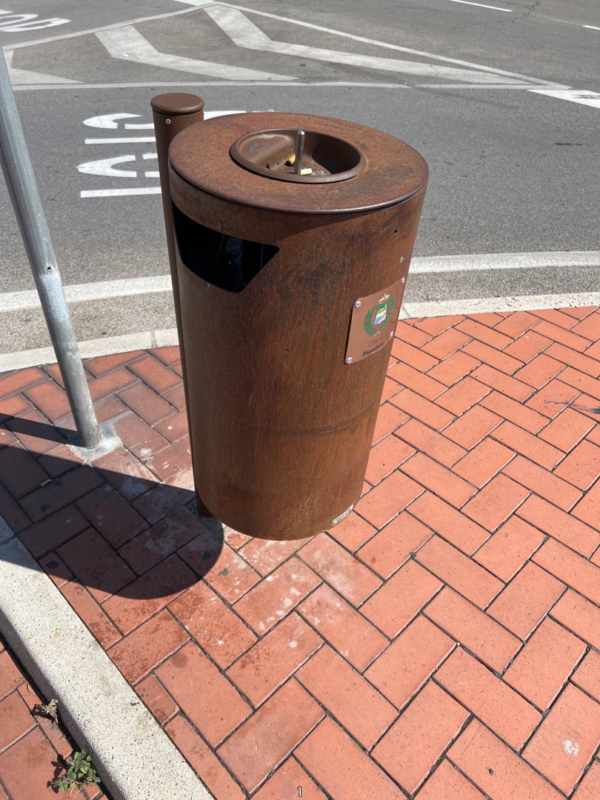
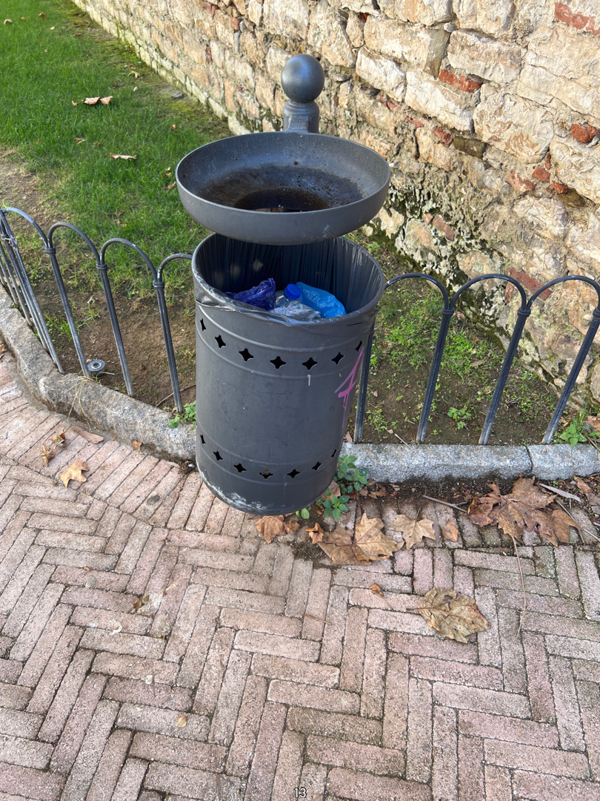
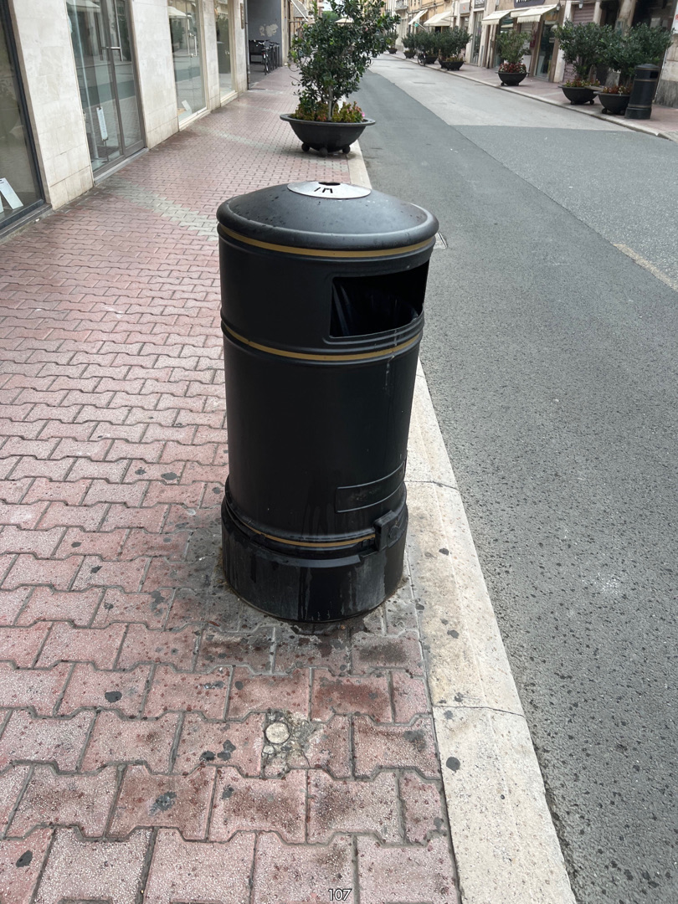
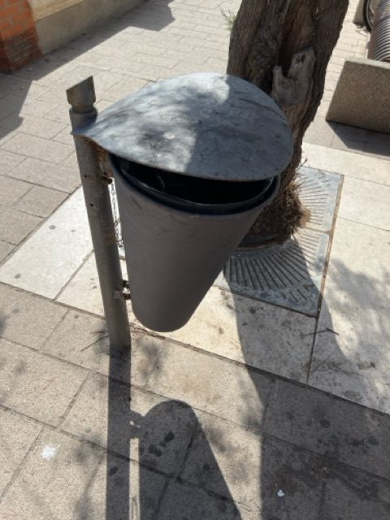

<p align="center">
  
</p>

<p align="center">
  Questo repository è il punto d'incontro tra la mia vita fisica e quella digitale. 
  Qui raccolgo e curo tutto ciò che traccio: dalle <strong>panchine</strong> che incontro passeggiando, alle <strong>partite di scacchi</strong> che gioco online, fino ai <strong>meme audio</strong> che hanno fatto la storia.
</p>


## Indice

- [Indice](#indice)
- [Dataset](#dataset)
- [Struttura progetto](#struttura-progetto)
- [Perchè](#perchè)
  - [Cestini](#cestini)
  - [SpeedTest](#speedtest)

## Dataset

<p align="right">(<a href="#indice">indice</a>)</p>

<table>
  <thead>
    <tr>
      <th>DATASET</th>
      <th>FILE PATH</th>
      <th>STANDARD</th>
      <th>STATO</th>
      <th>PRIMA ENTRY</th>
      <th>ULTIMA ENTRY</th>
      <th># ENTRIES</th>
      <th>LIVE</th>
    </tr>
  </thead>
  <tbody>
    <tr>
      <td>cestini</td>
      <td><a href="data/cestini.geojson">/data/cestini.geojson</a></td>
      <td>RFC 7946 (GeoJSON)</td>
      <td>in pausa</td>
      <td>2023-09-15</td>
      <td>2024-02-16</td>
      <td>260</td>
      <td><a href="http://geojson.io/#data=data:text/x-url,https://cdn.jsdelivr.net/gh/plumkewe/open-lyubomyr@main/data/cestini.geojson">geojson.io</a></td>
    </tr>
    <tr>
      <td>panchine</td>
      <td><a href="data/panchine.geojson">/data/panchine.geojson</a></td>
      <td>OSM Tags</td>
      <td>in pausa</td>
      <td>2023-10-06</td>
      <td>2025-10-08</td>
      <td>159</td>
      <td><a href="http://geojson.io/#data=data:text/x-url,https://cdn.jsdelivr.net/gh/plumkewe/open-lyubomyr@main/data/panchine.geojson">geojson.io</a></td>
    </tr>
    <tr>
      <td>fiori</td>
      <td><a href="data/fiori.geojson">/data/fiori.geojson</a></td>
      <td>GBIF Taxonomy</td>
      <td>in pausa</td>
      <td>2022-09-01</td>
      <td>2023-10-06</td>
      <td>189</td>
      <td><a href="http://geojson.io/#data=data:text/x-url,https://cdn.jsdelivr.net/gh/plumkewe/open-lyubomyr@main/data/fiori.geojson">geojson.io</a></td>
    </tr>
    <tr>
      <td>iamhere</td>
      <td><a href="data/iamhere.geojson">/data/iamhere.geojson</a></td>
      <td>OSM Artwork</td>
      <td>completo</td>
      <td></td>
      <td></td>
      <td>45</td>
      <td><a href="http://geojson.io/#data=data:text/x-url,https://cdn.jsdelivr.net/gh/plumkewe/open-lyubomyr@main/data/iamhere.geojson">geojson.io</a></td>
    </tr>
    <tr>
      <td>chess</td>
      <td><a href="data/chess.json">/data/chess.json</a></td>
      <td>PGN Standard</td>
      <td>attivo</td>
      <td>2022-11-05</td>
      <td>2025-08-23</td>
      <td>2383</td>
      <td>-</td>
    </tr>
    <tr>
      <td>zeb89</td>
      <td><a href="data/zeb89.json">/data/zeb89.json</a></td>
      <td>Custom JSON</td>
      <td>completo</td>
      <td></td>
      <td></td>
      <td>100</td>
      <td>-</td>
    </tr>
    <tr>
      <td>voti</td>
      <td><a href="data/voti.json">/data/voti.json</a></td>
      <td>Custom JSON</td>
      <td>completo</td>
      <td>2020-10-02</td>
      <td>2025-06-03</td>
      <td>343</td>
      <td>-</td>
    </tr>
    <tr>
      <td>speedtests</td>
      <td><a href="data/speedtests.json">/data/speedtests.json</a></td>
      <td>Custom JSON</td>
      <td>completo</td>
      <td>2024-12-23</td>
      <td>2025-08-27</td>
      <td>2111</td>
      <td>-</td>
    </tr>
    <tr>
      <td>film</td>
      <td><a href="data/film.json">/data/film.json</a></td>
      <td>Custom JSON</td>
      <td>attivo</td>
      <td>2022-02-28</td>
      <td>2025-09-13</td>
      <td>258</td>
      <td>-</td>
    </tr>
</table>

## Struttura progetto

<p align="right">(<a href="#indice">indice</a>)</p>

```
├── assets/
├── data/
│   ├── cestini.geojson
│   ├── chess.json
│   ├── fiori.geojson
│   ├── iamhere.geojson
│   ├── panchine.geojson
│   ├── voti.json
│   ├── zeb89.json
│   ├── speedtests.json
│   └── film.json
├── media/
│   ├── audio/
│   └── images/
├── README.md
```

## Perchè

<p align="right">(<a href="#indice">indice</a>)</p>

### Cestini

Tutto è nato dalla frustrazione di vedere rifiuti fuori dai cestini a Piombino. Volevo capirci qualcosa di più, numeri alla mano. Ho creato un commando rapido sul mio iPhone che rende la raccolta dati immediata: vedo un cestino, faccio un tap, e lui archivia foto e posizione GPS.

Per approfondire il progetto, visita il mio blog: [CESTINI su aaa.craft.me](https://aaa.craft.me/blog/b/AE6DD80D-6506-46E1-B744-22B0EC17B047/)

<table>
  <tr>
    <th>Immagine</th>
    <th>Tipo (Tipologia)</th>
  </tr>
  <tr>
    <td></td>
    <td>Nuovo</td>
  </tr>
  <tr>
    <td></td>
    <td>Intero</td>
  </tr>
  <tr>
    <td></td>
    <td>Piccolo</td>
  </tr>
  <tr>
    <td></td>
    <td>Mezzo</td>
  </tr>
  <tr>
    <td></td>
    <td>Struttura-B</td>
  </tr>
  <tr>
    <td></td>
    <td>Struttura-M</td>
  </tr>
  <tr>
    <td></td>
    <td>Struttura-M2</td>
  </tr>
    <tr>
    <td></td>
    <td>Struttura-M3</td>
  </tr>
  <tr>
    <td></td>
    <td>Struttura-M4</td>
  </tr>
</table>

### SpeedTest

Un confronto dati alla mano tra un operatore "Big" (WindTre) e un virtuale (CoopVoce). Il tracking è iniziato per validare la mia scelta di abbandonare un piano 5G costoso e tecnicamente limitato (cap a 10Mbps, problemi indoor) a favore di una connessione 4G su rete TIM (CoopVoce).

Per approfondire il progetto, visita il mio blog: [ISP su aaa.craft.me](https://aaa.craft.me/blog/b/1E243D83-B680-41A5-8B1D-8F6BFC76412B/(ISP))

> [!NOTE]
> Alla fine CoopVoce era passato a Vodafone, ed io a Tim 5G, che va molto meglio e pago la stessa somma.