<p align="center">
  
</p>

<p align="center">
  Questo repository è un archivio di dataset personali raccolti nel tempo come pratica di <em>quantified self</em>.
  I dati documentano attività, abitudini e osservazioni sia fisiche che digitali.
  I dataset sono strutturati e, quando applicabile, arricchiti tramite API esterne,
  con attenzione alla qualità, alla continuità temporale e alla riusabilità.
</p>


## Indice 

- [Indice](#indice) <!-- omit in toc -->
- [Struttura progetto](#struttura-progetto)
- [Come funziona](#come-funziona)
- [Dataset](#dataset)
  - Geografici
    - [Cestini](#cestini)
    - [Panchine](#panchine)
    - [Fiori](#fiori)
    - [I am here](#i-am-here)
  - Personali
    - [Chess](#chess)
      - [Qualche ricordo](#qualche-ricordo)
    - [Voti](#voti)
    - [Passi](#passi)
    - [Caffè](#caffe)
    - [Acqua](#acqua)
  - Hobby
    - [Parole](#parole)
      - [Shortcut](#shortcut)
      - [Telegram](#telegram)
    - [Wordle](#wordle)
    - [Film](#film)
  - Progetti
    - [Speed tests](#speed-tests)
    - [Zeb89](#zeb89)


## Struttura progetto

<p align="right">(<a href="#indice">indice</a>)</p>

```graphql
├── assets/
│   └── credits/
├── data/
│   ├── cestini.geojson
│   ├── fiori.geojson
│   ├── iamhere.geojson
│   ├── panchine.geojson
│   ├── chess.json
│   ├── zeb89.json
│   ├── voti.json
│   ├── speedtests.json
│   ├── film.json
│   ├── passi.json
│   ├── parole.json
│   ├── wordle.json
│   ├── acqua.json
│   └── caffe.json
├── media/
│   ├── audio/
│   └── images/
├── README.md
```

## Come funziona

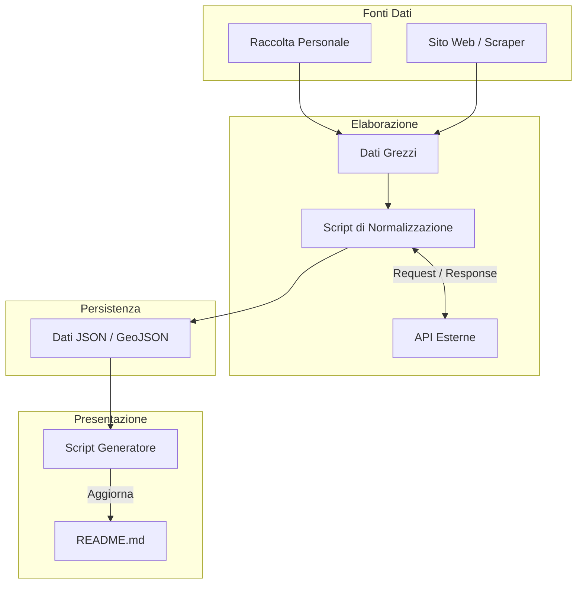
```mermaid
graph TD
    subgraph Input [Fonti Dati]
        User[Raccolta Personale]
        Site[Sito Web / Scraper]
    end

    subgraph Processing [Elaborazione]
        Raw[Dati Grezzi]
        Norm[Script di Normalizzazione]
        API[API Esterne]
        
        Raw --> Norm
        Norm <-->|Request / Response| API
    end

    subgraph Storage [Persistenza]
        Data[Dati JSON / GeoJSON]
    end

    subgraph View [Presentazione]
        Gen[Script Generatore]
        MD[README.md]
    end

    %% Collegamenti tra i blocchi
    User --> Raw
    Site --> Raw
    Norm --> Data
    Data --> Gen
    Gen -->|Aggiorna| MD
```

## Dataset

<p align="right">(<a href="#indice">indice</a>)</p>

<!-- tabella da aggiornare-->
<table>
<thead>
<tr>
<th>DATASET</th>
<th>FILE PATH</th>
<th>STANDARD</th>
<th>STATO</th>
<th>PRIMA ENTRY</th>
<th>ULTIMA ENTRY</th>
<th># ENTRIES</th>
<th>LIVE</th>
</tr>
</thead>
<tbody>
<tr>
<td>cestini</td>
<td><a href="data/cestini.geojson">/data/cestini.geojson</a></td>
<td>RFC 7946 (GeoJSON)</td>
<td>in pausa</td>
<td>2023-09-15</td>
<td>2024-02-16</td>
<td>260</td>
<td><a href="http://geojson.io/#data=data:text/x-url,https://cdn.jsdelivr.net/gh/plumkewe/open-lyubomyr@main/data/cestini.geojson">geojson.io</a></td>
</tr>
<tr>
<td>panchine</td>
<td><a href="data/panchine.geojson">/data/panchine.geojson</a></td>
<td>OSM Tags</td>
<td>in pausa</td>
<td>2023-10-06</td>
<td>2025-10-08</td>
<td>159</td>
<td><a href="http://geojson.io/#data=data:text/x-url,https://cdn.jsdelivr.net/gh/plumkewe/open-lyubomyr@main/data/panchine.geojson">geojson.io</a></td>
</tr>
<tr>
<td>fiori</td>
<td><a href="data/fiori.geojson">/data/fiori.geojson</a></td>
<td>GBIF Taxonomy</td>
<td>in pausa</td>
<td>2022-09-01</td>
<td>2023-10-06</td>
<td>189</td>
<td><a href="http://geojson.io/#data=data:text/x-url,https://cdn.jsdelivr.net/gh/plumkewe/open-lyubomyr@main/data/fiori.geojson">geojson.io</a></td>
</tr>
<tr>
<td>iamhere</td>
<td><a href="data/iamhere.geojson">/data/iamhere.geojson</a></td>
<td>OSM Artwork</td>
<td>completo</td>
<td></td>
<td></td>
<td>45</td>
<td><a href="http://geojson.io/#data=data:text/x-url,https://cdn.jsdelivr.net/gh/plumkewe/open-lyubomyr@main/data/iamhere.geojson">geojson.io</a></td>
</tr>
<tr>
<td>chess</td>
<td><a href="data/chess.json">/data/chess.json</a></td>
<td>PGN Standard</td>
<td>attivo</td>
<td>2022-11-05</td>
<td>2025-08-23</td>
<td>2383</td>
<td>-</td>
</tr>
<tr>
<td>zeb89</td>
<td><a href="data/zeb89.json">/data/zeb89.json</a></td>
<td>Custom JSON</td>
<td>completo</td>
<td></td>
<td></td>
<td>100</td>
<td>-</td>
</tr>
<tr>
<td>voti</td>
<td><a href="data/voti.json">/data/voti.json</a></td>
<td>Custom JSON</td>
<td>completo</td>
<td>2020-10-02</td>
<td>2025-06-03</td>
<td>343</td>
<td>-</td>
</tr>
<tr>
<td>speedtests</td>
<td><a href="data/speedtests.json">/data/speedtests.json</a></td>
<td>Custom JSON</td>
<td>completo</td>
<td>2024-12-23</td>
<td>2025-08-27</td>
<td>2111</td>
<td>-</td>
</tr>
<tr>
<td>film</td>
<td><a href="data/film.json">/data/film.json</a></td>
<td>Custom JSON</td>
<td>attivo</td>
<td>2023-04-07</td>
<td>2026-01-25</td>
<td>254</td>
<td>-</td>
</tr>
<tr>
<td>passi</td>
<td><a href="data/passi.json">/data/passi.json</a></td>
<td>Custom JSON</td>
<td>attivo</td>
<td>2021-09-24</td>
<td>2026-01-31</td>
<td>22864</td>
<td>-</td>
</tr>
<tr>
<td>parole</td>
<td><a href="data/parole.json">/data/parole.json</a></td>
<td>Custom JSON</td>
<td>attivo</td>
<td>2024-12-09</td>
<td>2025-12-08</td>
<td>3250</td>
<td>-</td>
</tr>
<tr>
<td>wordle</td>
<td><a href="data/wordle.json">/data/wordle.json</a></td>
<td>Custom JSON</td>
<td>attivo</td>
<td>2025-01-01</td>
<td>2026-01-26</td>
<td>377</td>
<td>-</td>
</tr>

<tr>
<td>acqua</td>
<td><a href="data/acqua.json">/data/acqua.json</a></td>
<td>Custom JSON</td>
<td>completo</td>
<td>2022-04-05</td>
<td>2022-12-26</td>
<td>1563</td>
<td>-</td>
</tr>

<tr>
<td>caffè</td>
<td><a href="data/caffe.json">/data/caffe.json</a></td>
<td>Custom JSON</td>
<td>attivo</td>
<td>2023-04-27</td>
<td>2026-01-30</td>
<td>39</td>
<td>-</td>
</tr></tbody></table>
<!-- tabella da aggiornare-->


<p align="right">(<a href="#indice">indice</a>)</p>

### Geografici

#### Cestini

Tutto è nato dalla frustrazione di vedere rifiuti a pochi passi dai cestini a Piombino. Volevo capirci qualcosa di più, numeri alla mano. Ho creato un commando rapido sul mio iPhone che rende la raccolta dati immediata: vedo un cestino, faccio un tap, e lui archivia foto e posizione GPS.

Per approfondire il progetto, visita il mio blog: [CESTINI su aaa.craft.me](https://aaa.craft.me/blog/b/AE6DD80D-6506-46E1-B744-22B0EC17B047/)

<!-- data/cestini.geojson -->
<details>
<summary>Struttura</summary>

```json
{
    "type": "Feature",
    "id": "4A12E89A-543C-4F56-B131-030CC40428DC",
    "geometry": {
        "type": "Point",
        "coordinates": [
            10.52283650762667,
            42.92546109446996
        ]
    },
    "properties": {
        "name": "Cestino",
        "ref": "1",
        "amenity": "waste_basket",
        "short_id": "O3QY4W",
        "address": "Via Giovanni Pascoli 2\n57025 Piombino Tuscany\nItaly",
        "type": "Nuovo",
        "image_url": "media/image/C019CAC7-8B2C-45C0-9F1F-802834FC0613.jpg",
        "created_at": "2023-09-15T10:22:56Z",
        "modified_at": "2023-09-15T10:22:57Z"
    }
}
```
</details>

<table>
  <tr>
    <th colspan="4">IMMAGINE</th>
    <th>TIPOLOGIA</th>
  </tr>
  
  <tr>
    <td>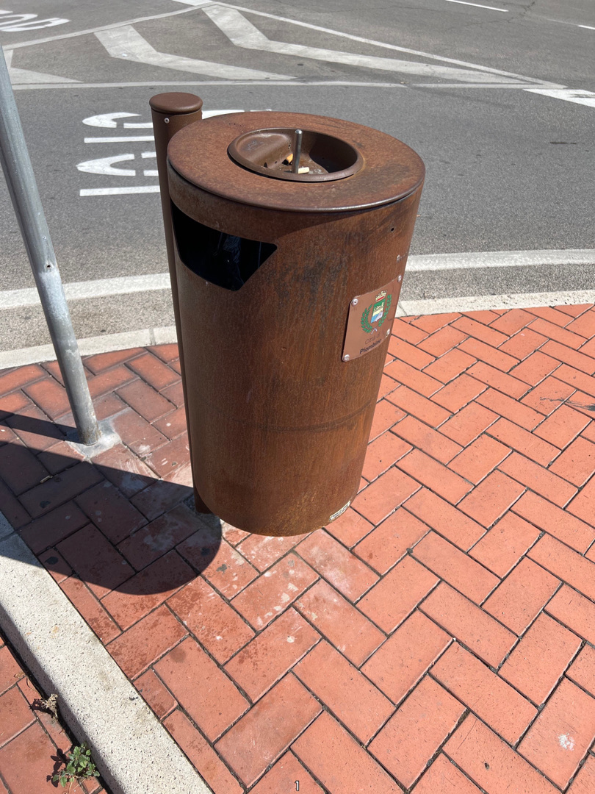</td>
    <td></td> <td></td> <td></td> <td>Nuovo</td>
  </tr>

  <tr>
    <td>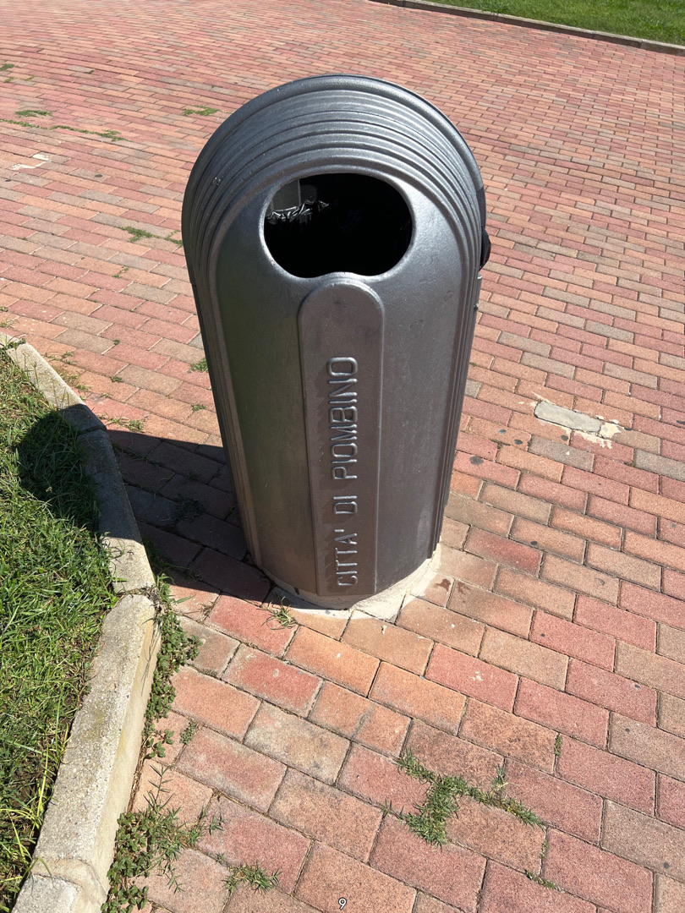</td>
    <td></td>
    <td></td>
    <td></td>
    <td>Intero</td>
  </tr>

  <tr>
    <td>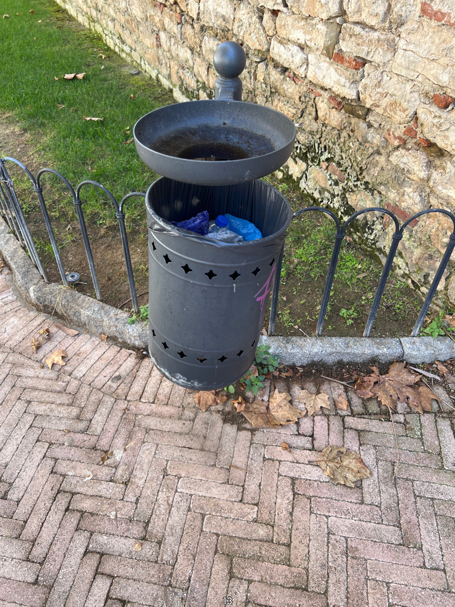</td>
    <td>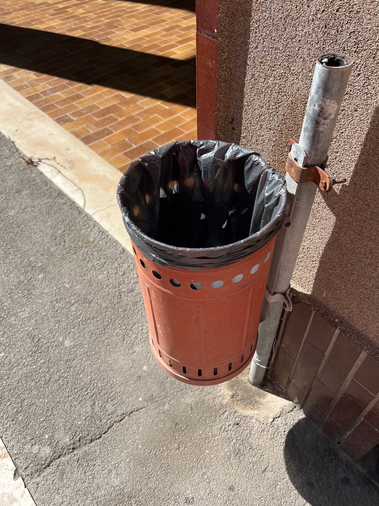</td>
    <td>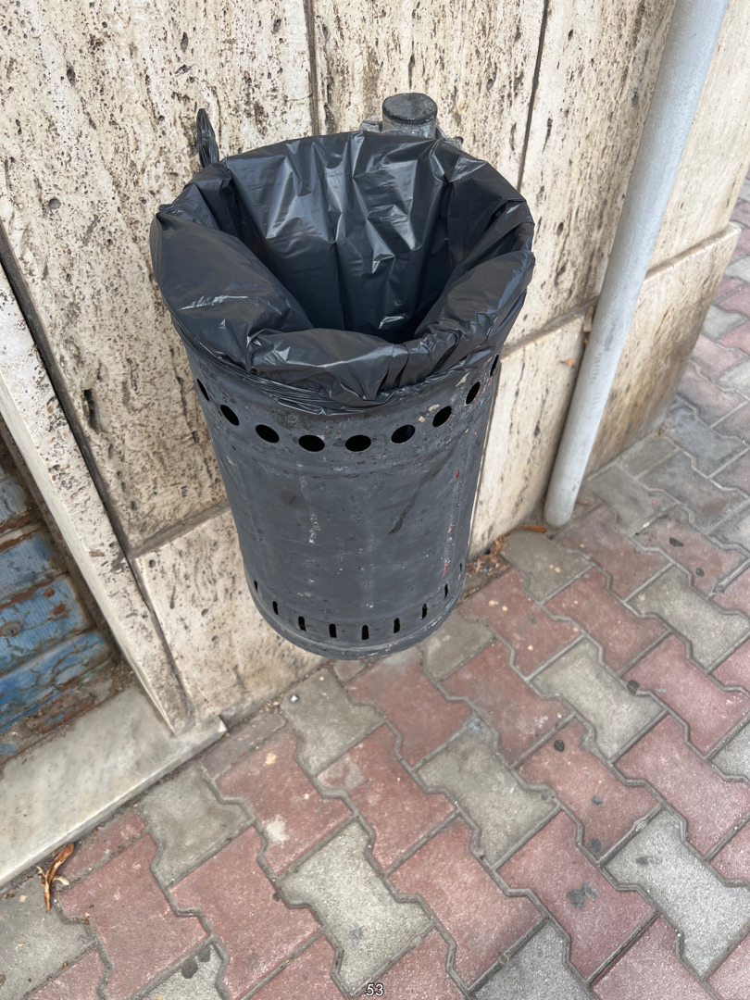</td>
    <td>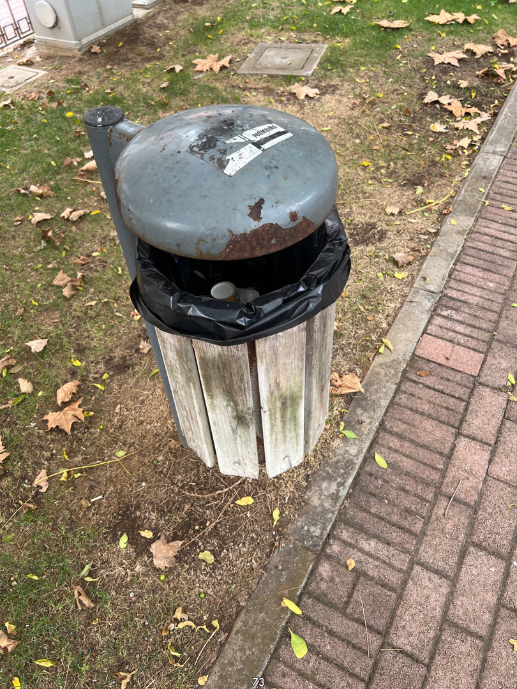</td>
    <td>Piccolo</td>
  </tr>

  <tr>
    <td>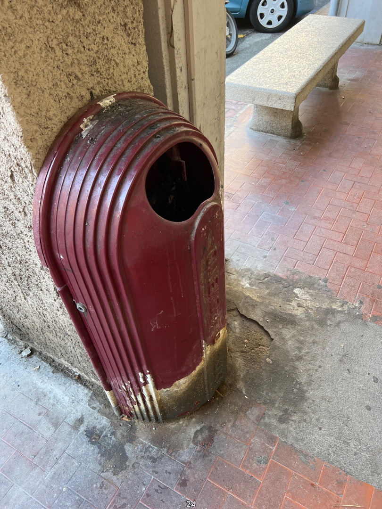</td>
    <td>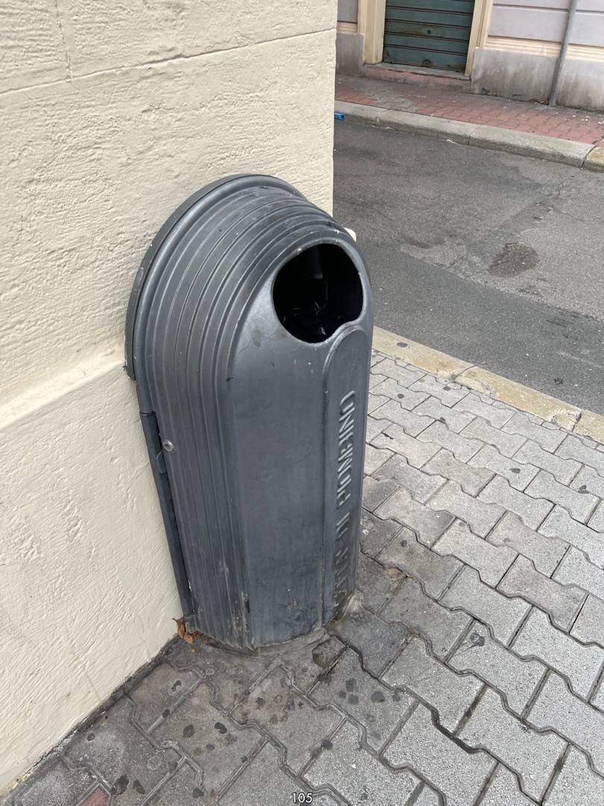</td>
    <td></td> <td></td> <td>Mezzo</td>
  </tr>

  <tr>
    <td>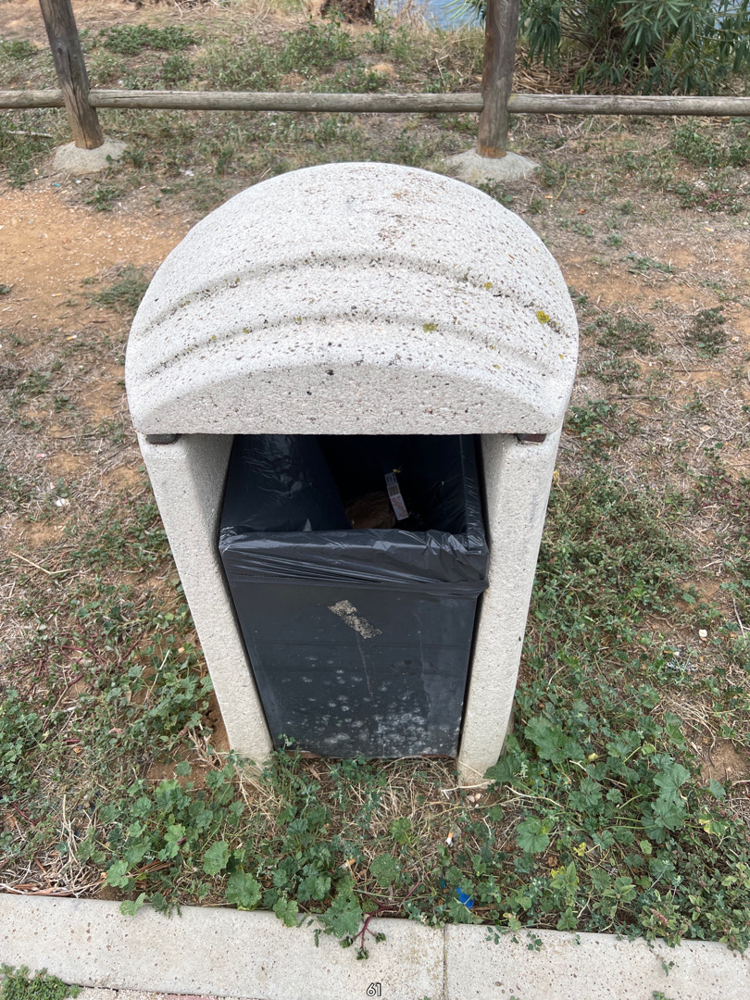</td>
    <td></td>
    <td></td>
    <td></td>
    <td>Struttura-B</td>
  </tr>

  <tr>
    <td>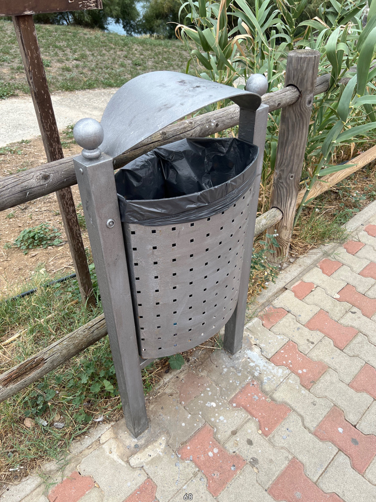</td>
    <td></td>
    <td></td>
    <td></td>
    <td>Struttura-M</td>
  </tr>

  <tr>
    <td>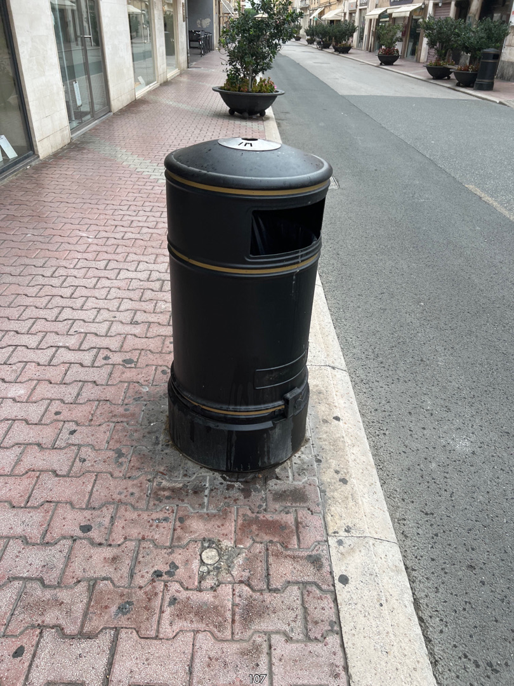</td>
    <td></td>
    <td></td>
    <td></td>
    <td>Struttura-M2</td>
  </tr>
  
  <tr>
    <td>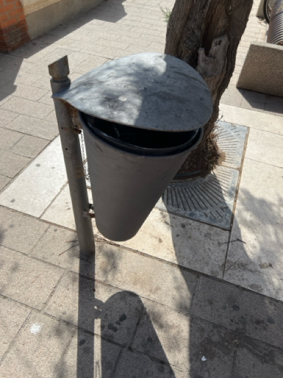</td>
    <td></td>
    <td></td>
    <td></td>
    <td>Struttura-M3</td>
  </tr>

  <tr>
    <td>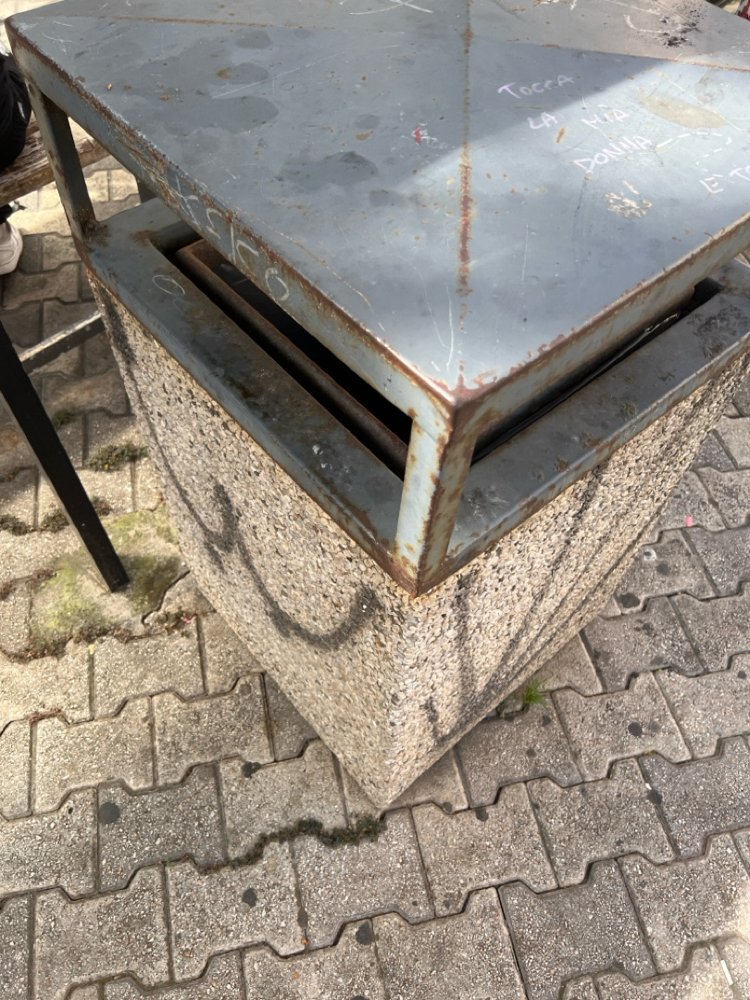</td>
    <td></td>
    <td></td>
    <td></td>
    <td>Struttura-M4</td>
  </tr>
</table>

#### Panchine

<!-- data/panchine.geojson -->
<details>
<summary>Struttura</summary>

```json
{
    "type": "Feature",
    "id": "7459E15D-4735-4721-9C8E-5C34B251010A",
    "geometry": {
        "type": "Point",
        "coordinates": [
            10.525580861797891,
            42.92213019024307
        ]
    },
    "properties": {
        "name": "Panchina",
        "ref": "1",
        "amenity": "bench",
        "short_id": "CHM3JM",
        "address": "Via della Marina 7–99\n57025 Piombino Tuscany\nItaly",
        "image_url": "media/image/83A5EB23-3B48-46B5-8491-D2E4EEA04D7C.jpg",
        "created_at": "2023-10-06T15:59:54Z",
        "modified_at": "2023-10-06T15:59:56Z"
    }
}
```
</details>

<hr>

#### Fiori

Volevo avere un dataset dei fiori, così me lo sono creato. Ora so dove si trovano vari fiori e anche di che colore sono! Dovrei però aggiungere i dati su quando fioriscono.

<!-- data/fiori.geojson -->
<details>
<summary>Struttura</summary>

```json
{
    "type": "Feature",
    "id": "1F301B96-5AD7-4968-A1BA-5745ADF6F450",
    "geometry": {
        "type": "Point",
        "coordinates": [
            10.52161,
            42.92774
        ]
    },
    "properties": {
        "natural": "plant",
        "scientificName": "Rose",
        "vernacularName": "Rose",
        "flower:colour": "#10C9CC",
        "eventDate": "2023-10-06T16:59:34Z",
        "occurrenceRemarks": "",
        "associatedMedia": "media/image/3412DCCC-E76B-4323-8382-0F9F2E90FC81.jpg",
        "short_id": "X49XV6",
        "address": "Via Filippo Turati 6A\n57025 Piombino Toscana\nItalia"
    }
}
```
</details>

<hr>

#### I am here

Ogni tanto uscivo a Piombino e mi imbattevo in dei graffiti "I am here". Mi ero incuriosito, così ho iniziato a camminare sia nella realtà sia su Google Maps, usando la funzione “guarda indietro”, per individuare i graffiti che ormai sono stati cancellati o parzialmente coperti.

<!-- data/iamhere.geojson -->
<details>
<summary>Struttura</summary>

```json
{
    "type": "Feature",
    "id": "6160A864-7255-455D-A9D0-8900FFB34B62",
    "geometry": {
        "type": "Point",
        "coordinates": [
            10.5319904,
            42.9257633
        ]
    },
    "properties": {
        "id": "6160A864-7255-455D-A9D0-8900FFB34B62",
        "name": "I am here",
        "tourism": "artwork",
        "artwork_type": "graffiti",
        "inscription": "I am here",
        "original_note": "",
        "comment": "",
        "visibility": "public"
    }
}
```
</details>

<hr>

### Personali

#### Chess

Avevo co-fondato Scacchi Piombino insieme al mio amico e, a quel tempo, giocavo molto a scacchi. Allora mi sono detto: “Perché non avere un dataset per confermare quanto faccio schifo?”. Tutto è iniziato con un semplice messaggio: “E se facessimo un club scacchistico?” E niente, l’abbiamo fatto! Lo trovate ancora su Google Maps. 

Avevamo anche collaborato con la Biblioteca Civica Falesiana; potete trovare qualche post sulla loro pagina Facebook.

**Link:** https://maps.app.goo.gl/FW8y27prsTJfGnFaA

<!-- data/chess.json -->
<details>
<summary>Struttura</summary>

```json
{
    "id": "486731945",
    "url": "https://www.chess.com/game/daily/486731945",
    "date": "2023.03.06",
    "pgn_result": "1-0",
    "termination": "checkmated",
    "move_count": 18,
    "fen": "r1b2k1r/ppN3Qp/2p1p2B/8/4P3/3P4/PPP3PP/R2K4 b - - 0 18",
    "pgn": "[Event \"Let's Play!\"]\n[Site \"Chess.com\"]\n[Date \"2023.03.06\"]\n[Round \"-\"]\n[White \"faxtrix\"]\n[Black \"manofurlas\"]\n[Result \"1-0\"]\n[CurrentPosition \"r1b2k1r/ppN3Qp/2p1p2B/8/4P3/3P4/PPP3PP/R2K4 b - - 0 18\"]\n[Timezone \"UTC\"]\n[ECO \"C25\"]\n[ECOUrl \"https://www.chess.com/openings/Vienna-Game-Anderssen-Defense-3.Bc4-Nf6\"]\n[UTCDate \"2023.03.06\"]\n[UTCTime \"20:38:41\"]\n[WhiteElo \"400\"]\n[BlackElo \"400\"]\n[TimeControl \"1/86400\"]\n[Termination \"faxtrix won by checkmate\"]\n[StartTime \"20:38:41\"]\n[EndDate \"2023.03.07\"]\n[EndTime \"14:14:41\"]\n[Link \"https://www.chess.com/game/daily/486731945\"]\n\n1. e4 {[%clk 0:00:03.3]} 1... e5 {[%clk 0:00:01.8]} 2. Bc4 {[%clk 0:00:06.7]} 2... Bc5 {[%clk 0:00:04.5]} 3. Nc3 {[%clk 0:00:06.6]} 3... Nf6 {[%clk 0:03:38.8]} 4. Nf3 {[%clk 0:00:35.9]} 4... Qe7 {[%clk 0:00:13.9]} 5. d3 {[%clk 0:01:12]} 5... Ng4 {[%clk 0:00:21.8]} 6. Nd5 {[%clk 0:00:38.6]} 6... Nxf2 {[%clk 0:00:15.3]} 7. Qe2 {[%clk 0:00:19.9]} 7... Qe6 {[%clk 0:00:08.8]} 8. Nxc7+ {[%clk 0:00:01.5]} 8... Ke7 {[%clk 0:02:19.5]} 9. Bxe6 {[%clk 0:00:05.2]} 9... fxe6 {[%clk 0:00:01.6]} 10. Rf1 {[%clk 0:00:02.7]} 10... Ng4 {[%clk 0:00:02.5]} 11. Bg5+ {[%clk 0:01:13.7]} 11... Kf7 {[%clk 0:00:03.7]} 12. Nxe5+ {[%clk 0:00:01.6]} 12... Kg8 {[%clk 0:00:59.1]} 13. Qxg4 {[%clk 0:00:00.6]} 13... Bb4+ {[%clk 0:06:35.3]} 14. Kd1 {[%clk 0:00:13.2]} 14... Nc6 {[%clk 1:10:15.2]} 15. Nxc6 {[%clk 0:06:50.8]} 15... dxc6 {[%clk 0:04:34.9]} 16. Bh6 {[%clk 0:00:30]} 16... Bf8 {[%clk 0:03:47.5]} 17. Rxf8+ {[%clk 0:00:06.8]} 17... Kxf8 {[%clk 0:00:01.1]} 18. Qxg7# {[%clk 0:00:01.6]} 1-0",
    "players": {
        "white": {
            "username": "faxtrix",
            "rating": 400,
            "accuracy": 93.61,
            "result": "win"
        },
        "black": {
            "username": "manofurlas",
            "rating": 400,
            "accuracy": 64.42,
            "result": "loss"
        }
    }
}
```
</details>

#### Qualche ricordo 

<table>
    <tr>
        <th>Inizio</th>
        <th>Il gruppo su WA eravamo quasi 100 al picco</th>
        <th>Il volantino che fu stampato</th>
    </tr>
    <tr>
        <td align="center">
            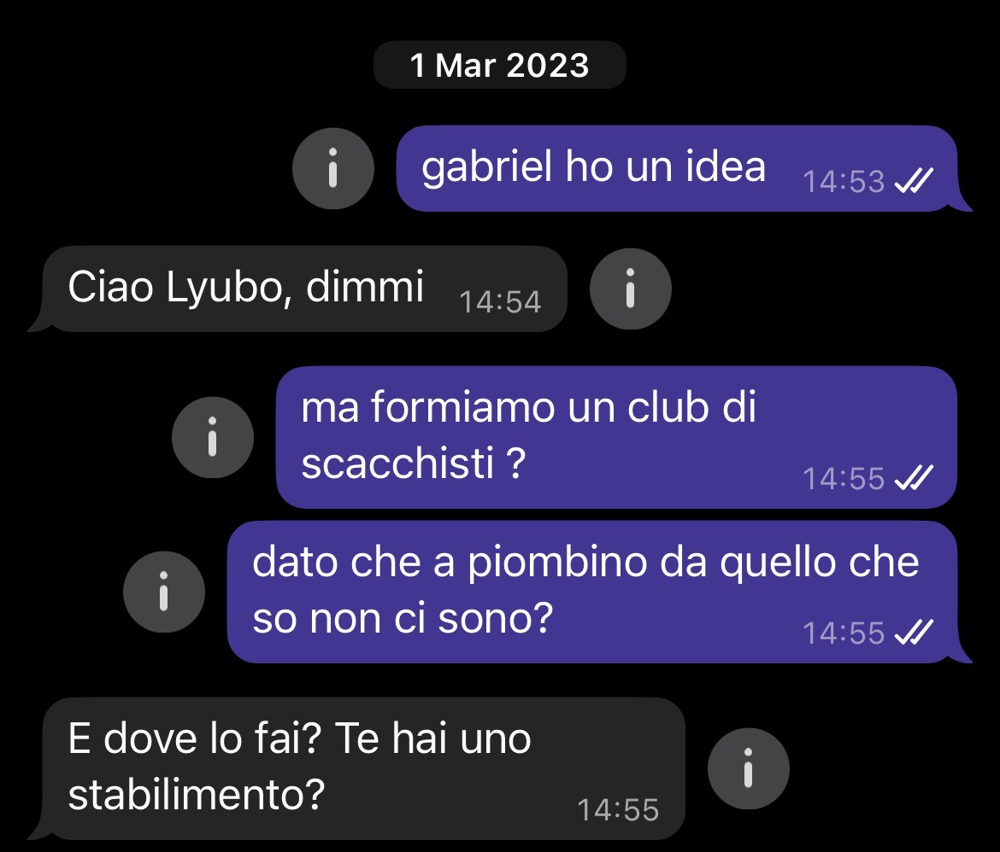
        </td>
        <td align="center">
            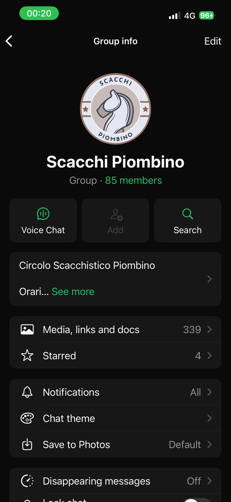
        </td>
        <td align="center">
            
        </td>
    </tr>
</table>

<hr>

#### Zeb89

Avevo scoperto questo YouTuber che abitava a Bibbona e i suoi vecchi video mi fecero ridere così tanto che mi dissi: “Ma perché non mi faccio una soundboard tutta mia con le sue frasi più iconiche?”. E così l’ho fatto.

<!-- data/zeb89.json -->
<details>
<summary>Struttura</summary>

```json
{
    "id": "BB410D05-366C-4445-B428-E23AD26615B5",
    "short_id": "0IMON0",
    "filename": "0IMON0.m4a",
    "title": "vaffanculo pezzo di merda",
    "description": "",
    "duration_seconds": 6,
    "category": "Uncategorized",
    "is_published": true
}
```
</details>

<hr>

#### Voti

Ero curioso di sapere quanto facessi schifo a scuola e quanto me ne potesse fregare ancora di meno.

<!-- data/voti.json -->
<details>
<summary>Struttura</summary>

```json
{
    "id": "D22ABDAC-B338-4E25-8B1D-794AFC1D06DE",
    "subject": "Italiano",
    "date": "2020-10-02",
    "grade": 5.0,
    "type": "scritto"
}
```
</details>

<hr>

#### Speed tests

Odio WindTre e le loro offerte del c*zzo, come quella che avevo io: 5G cappato a 10 Mbps che non erano mai davvero 10 Mbps. Per questo sono passato a CoopVoce che, all’epoca, si appoggiava a TIM e con cui navigavo molto meglio. Da lì avevo iniziato a fare speed test ogni ora, nella stessa posizione e con lo stesso telefono, per dimostrare quanto facesse schifo WindTre.

Alla fine, però, sono passato direttamente a TIM, perché CoopVoce stava migrando su Vodafone e le velocità erano diventate impraticabili.

Per approfondire il progetto, visita il mio blog: [ISP su aaa.craft.me](https://aaa.craft.me/blog/b/1E243D83-B680-41A5-8B1D-8F6BFC76412B/(ISP))

<!-- data/speedtests.json -->
<details>
<summary>Struttura</summary>

```json
{
    "id": "1B7B1A16-D15A-4F1F-92C2-0378DFC585AC",
    "timestamp": "2025-08-27T15:00:00",
    "type": "LTE",
    "vpn": false,
    "location": {
        "lat": 44.4847,
        "lon": 11.328,
        "server": "Rome"
    },
    "performance": {
        "download_mbps": 4.59,
        "upload_mbps": 2.63,
        "latency_ms": 35,
        "data_used": {
            "down_bytes": 5889131,
            "up_bytes": 3621204
        }
    },
    "network_info": {
        "external_ip": "193.207.155.47"
    }
}
```
</details>

<hr>

#### Film

Ogni tanto guardo qualche film, ma purtroppo le app disponibili non permettono di vedere e analizzare i dati sui film. Perciò ho trovato una mia soluzione.

<!-- data/film.json -->
<details>
<summary>Struttura</summary>

```json

```
</details>

<br>

**Dati aggiuntivi:**

<p align="center">
    
</p>

#### Passi

<!-- data/passi.json -->
<details>
<summary>Struttura</summary>

```json
{
    "timestamp": "2021-09-24T17:00:00",
    "date": "2021-09-24",
    "time": "17:00:00",
    "steps": 15
}
```
</details>

<hr>

#### Caffè

Ho iniziato l’università senza il caffè non si fa. I dati relativi alla caffeina sono solo una stima e non mi interessano; mi interessa solo quando ho bevuto il caffè.

<!-- data/caffe.json -->

<details>
<summary>Struttura</summary>

```json
{
    "timestamp": "2026-01-30T09:17:31",
    "date": "2026-01-30",
    "time": "09:17:31",
    "caffeine_mg": 70
}
```
</details>

#### Acqua

Volevo semplicemente sapere quanta acqua bevevo.

<!-- data/acqua.json -->
<details>
<summary>Struttura</summary>

```json
{
    "timestamp": "2022-04-05T17:00:00",
    "date": "2022-04-05",
    "time": "17:00:00",
    "water_ml": 270
}
```
</details>

#### Parole

Leggevo moltissimo in inglese e mi stufavo di aprire il dizionario ogni volta, quindi ho creato una shortcut su iPhone che, con un doppio tap sulla parte posteriore, si avviava e mi mostrava la parola con la definizione, dando anche la possibilità di aprirla nel dizionario o cercarne l’immagine su Google. Ovviamente salvava i dati in diversi posti per non perderli.

In seguito avevo creato anche un canale Telegram, nel quale condividevo ogni giorno 10 parole con un quiz, generato con ChatGPT.

Se siete curiosi di sapere quanto leggo e che cosa leggo, visita il mio blog: [QUANTO LEGGO su aaa.craft.me](https://aaa.craft.me/blog/b/5CE28A05-C36D-4601-AB7B-15B267A5EC62/(QUANTO-LEGGO))

<!-- data/parole.json -->
<details>
<summary>Struttura</summary>

```json
{
    "id": 1,
    "word": "rupture",
    "added_at": "2024-12-09T13:59:58",
    "meta": {
        "type": "noun",
        "date": "15th century{ds||2|a|}",
        "pronunciation": "ˈrəp(t)-shər",
        "audio_url": "https://media.merriam-webster.com/audio/prons/en/us/mp3/r/ruptur01.mp3",
        "definitions": [
            "breach of peace or concord; specifically : open hostility or war between nations",
            "the tearing apart of a tissue",
            "hernia"
        ],
        "etymology": "Middle English _ruptur_, from Anglo-French or Latin; Anglo-French _rupture_, from Latin _ruptura_ fracture, from _ruptus_, past participle of _rumpere_ to break {ma}{mat|reave|}{/ma}",
        "examples": [],
        "audio_path": "media/audio/ruptur01.mp3"
    }
}
```
</details>

#### Shortcut

Potete vedere come funziona in questa breve presentazione, creata perché fui obbligato a realizzarla per il Capolavoro delle superiori.

**Link:** https://www.youtube.com/watch?v=1xKgTMWL4Xw

<table>
    <tr>
        <th>Shortcut iPhone</th>
    </tr>
    <tr>
        <td align="center">
            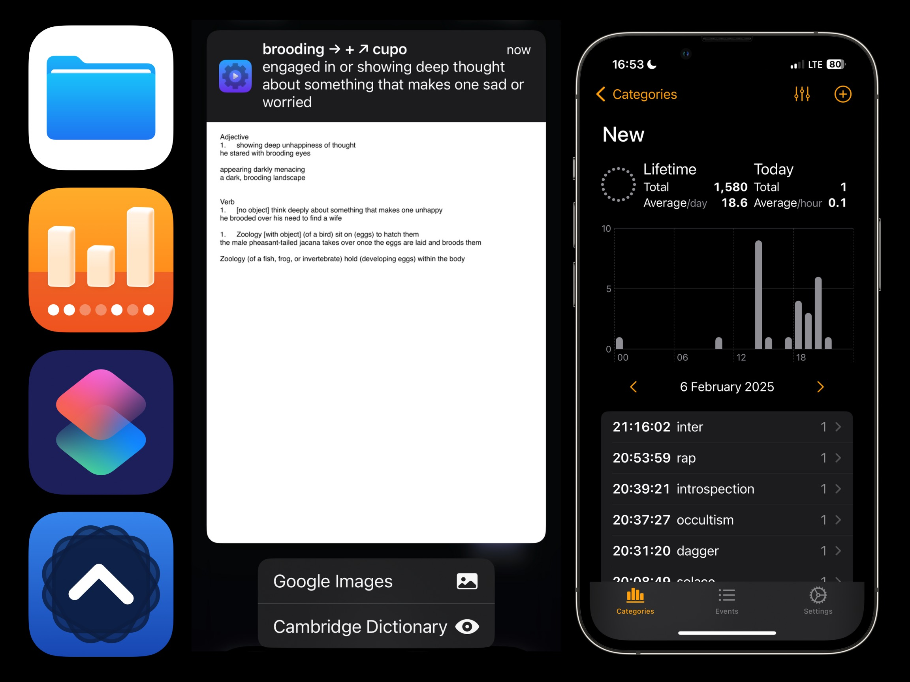
        </td>
    </tr>
</table>


#### Telegram

Il canale è sempre disponibile su Telegram, ma non è più attivo.

**Link:** https://t.me/PARwOrdsLE 

<table>
    <tr>
        <th>Qualche post</th>
        <th>Il quiz</th>
    </tr>
    <tr>
        <td align="center">
            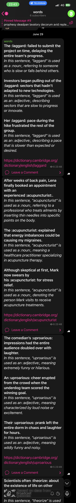
        </td>
        <td align="center">
            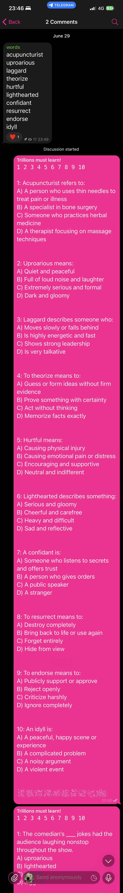
        </td>
    </tr>
</table>

<br>

**Dati aggiuntivi:**

<p align="center">
    
</p>

<hr>

#### Wordle 

Risolvo i Wordle, ed ero curioso di sapere come performavo, gioco per divertimento, ma sicuramente ci sono delle parole che ti fanno vincere prima, o no?

Visita il mio blog per scoprirlo: [WORDLE su aaa.craft.me](https://aaa.craft.me/blog/b/DC5540DE-2F0B-485C-BD8F-7784E02DE9E9/(WORDLE))

<!-- data/wordle.json -->
<details>
<summary>Struttura</summary>

```json
{
    "id": 1292,
    "word": "nerve",
    "added_at": "2025-01-01T07:49:00",
    "meta": {
        "score": 6,
        "attempts_count": 6,
        "guesses": [
            "OUGHT",
            "READY",
            "LEVIS",
            "FEVER",
            "KERVE",
            "NERVE"
        ],
        "solved": true
    }
}
```
</details>